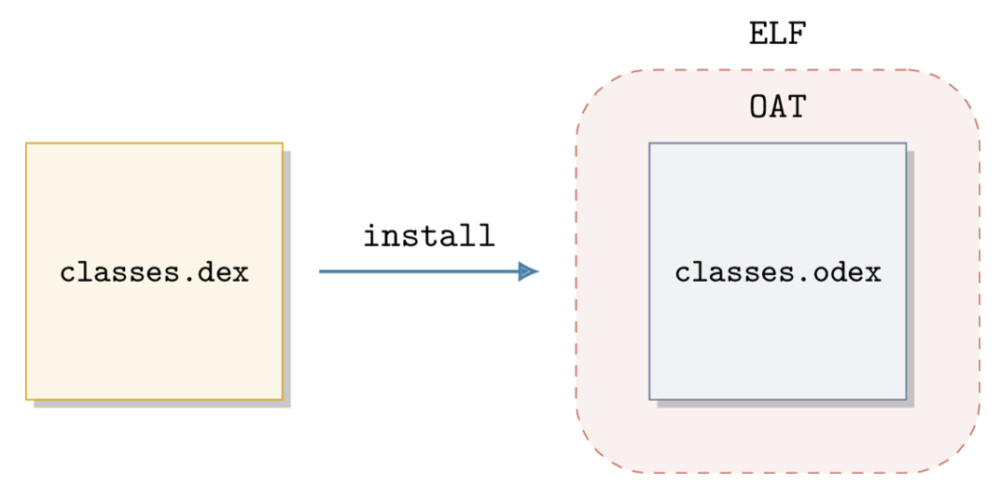
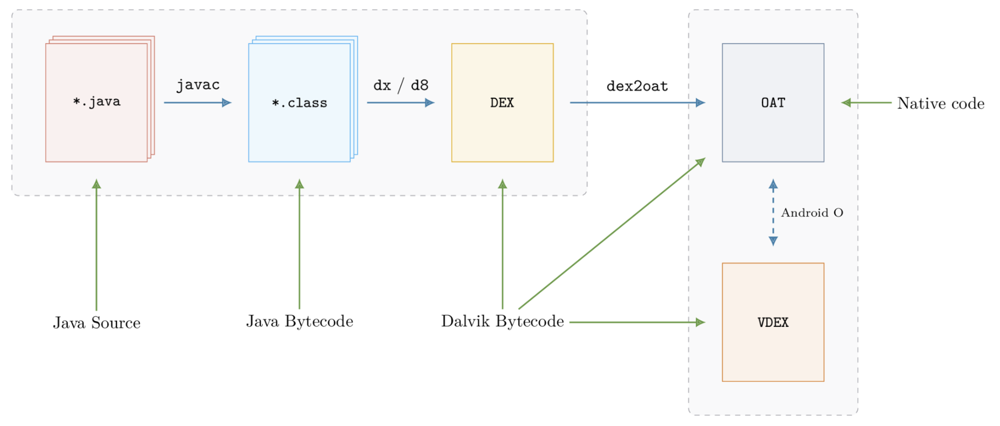

# Android中的ELF

* Android中的ELF格式
  * Android在通用的Linux中的ELF的基础上，进一步扩展
    * `.dex`/`.oat`: `ELF` + 扩展的section
    * `.dex`被转换成`.odex`
      * odex是外部是ELF头，内部包裹了个OAT格式
        * 
  * 解析Android的ELF格式
    * 详见
      * [Android · 可执行文件格式](https://book.crifan.org/books/executable_file_format/website/related_tool/lief/usage_examples/parse_android/)

## dex格式

dex文件就是ELF格式的：

```bash
$ file snet.dex
snet.dex: ELF 64-bit LSB shared object, ARM aarch64, version 1 (GNU/Linux), dynamically linked, stripped
```

* 注意
  * 不可轻信后缀
    * `.dex`可能是`DEX`或`OAT`
    * `.odex`是`OAT`
    * `.oat`是`OAT`

## OAT格式

* 把java转成OAT的过程
  * 
