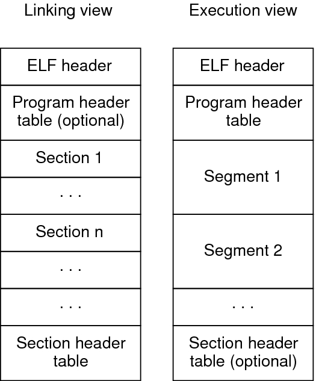
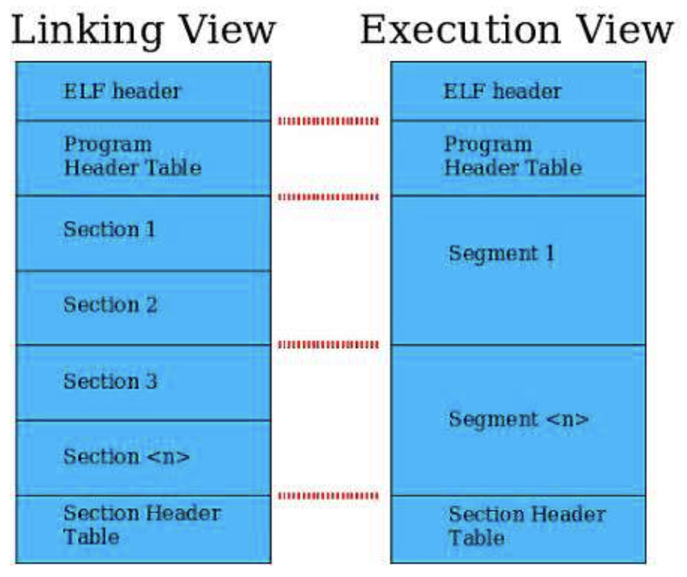
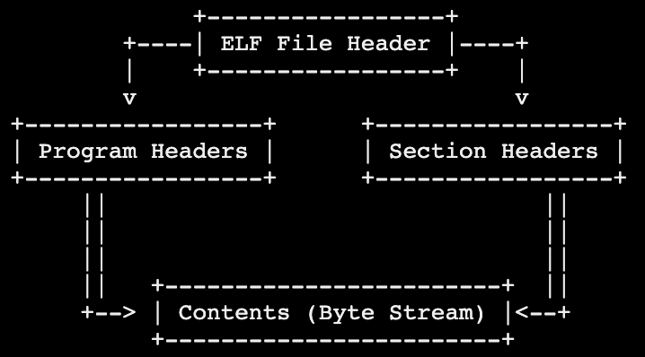

# ELF的2种视图

* ELF的2种视图views
  * 概述
    * Linking View
      * Linking链接时：需要Section Header Table，不需要Program Header Table
    * Execution View
      * Execution执行时：需要Program Header Table，不需要Section Header Table
  * ELF的2种视图
    * 
    * 
    * 
    * 文字版
      * 
        ```bash
                      +-----------------+
                +----| ELF File Header |----+
                |    +-----------------+    |
                v                           v
        +-----------------+      +-----------------+
        | Program Headers |      | Section Headers |
        +-----------------+      +-----------------+
              ||                               ||
              ||                               ||
              ||                               ||
              ||   +------------------------+  ||
              +--> | Contents (Byte Stream) |<--+
                  +------------------------+
        ```
