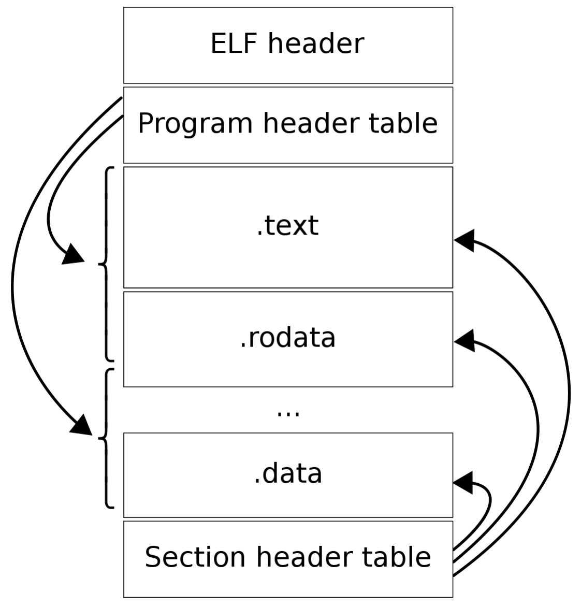
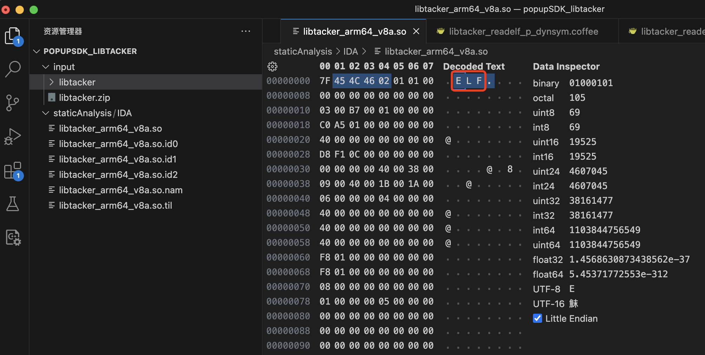
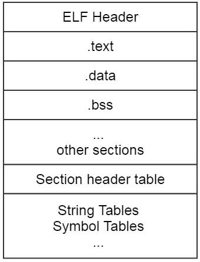
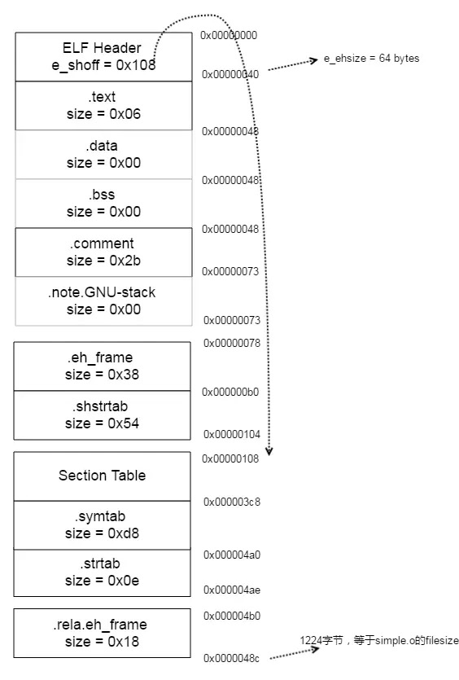
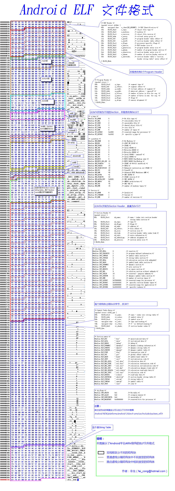

# ELF结构图

* ELF结构布局图=ELF layout
  * 
  * 文字版
    ```bash
        +-------------------------------+
        | ELF File Header               |
        +-------------------------------+
        | Program Header for segment #1 |
        +-------------------------------+
        | Program Header for segment #2 |
        +-------------------------------+
        | ...                           |
        +-------------------------------+
        | Contents (Byte Stream)        |
        | ...                           |
        +-------------------------------+
        | Section Header for section #1 |
        +-------------------------------+
        | Section Header for section #2 |
        +-------------------------------+
        | ...                           |
        +-------------------------------+
        | ".shstrtab" section           |
        +-------------------------------+
        | ".symtab"   section           |
        +-------------------------------+
        | ".strtab"   section           |
        +-------------------------------+
    ```
    * 举例
      * 打开so可以看到顶部有ELF字样
        * 
  * 
  * 


## 举例

### Android ELF 文件格式

* Android ELF 文件格式
  * 
