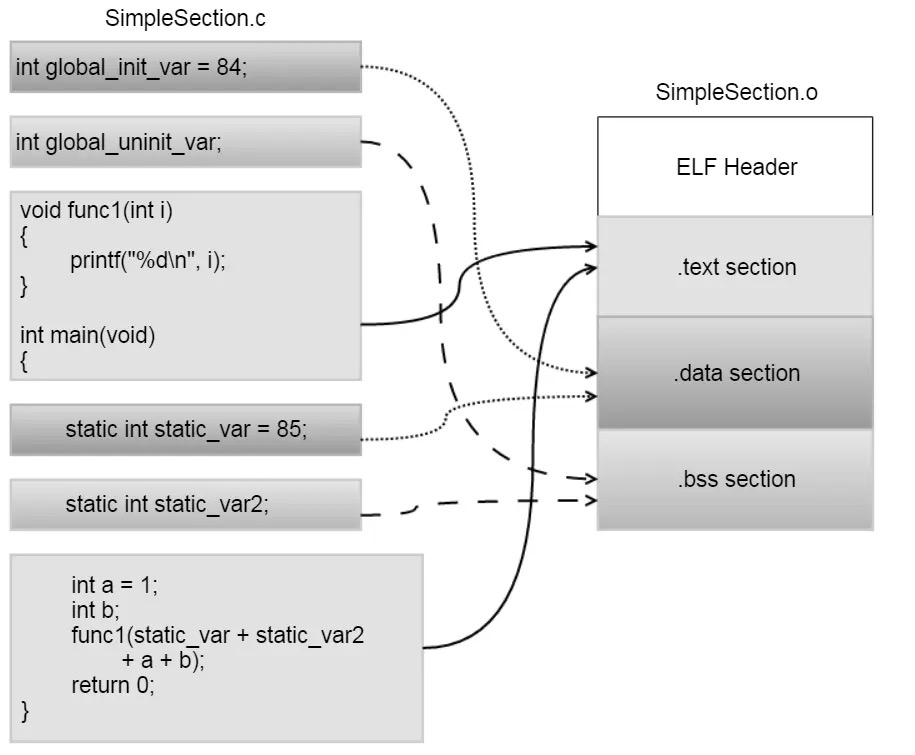

# section节

## ELF中常见的section节

* `.bss`：Uninitialized global data ("Block Started by Symbol")
* `.comment`：A series of NULL-terminated strings containing compiler information.
* `.ctors`：Pointers to functions which are marked as `__attribute__ ((constructor))` as well as static C++ objects' constructors. They will be used by `__libc_global_ctors` function.
* `.data`：Initialized data
* `.data.rel.ro`：Similar to `.data` section, but this section should be made Read-Only after relocation is done.
* `.debug_XXX`：Debugging information (for the programs which are compiled with `-g` option) which is in the [DWARF](https://dwarfstd.org/) 2.0 format.
* `.dtors`：Pointers to functions which are marked as `__attribute__ ((destructor))` as well as static C++ objects' destructors.
* `.dynamic`：For dynamic binaries, this section holds dynamic linking information used by `ld.so`
* `.dynstr`：NULL-terminated strings of names of symbols in `.dynsym` section.
  * One can use commands such as `readelf -p .dynstr a.out` to see these strings.
* `.dynsym`：Runtime/Dynamic symbol table. For dynamic binaries, this section is the symbol table of globally visible symbols. For example, if a dynamic link library wants to export its symbols, these symbols will be stored here. On the other hand, if a dynamic executable binary uses symbols from a dynamic link library, then these symbols are stored here too.
  * The symbol names (as NULL-terminated strings) are stored in `.dynstr` section.
* `.eh_frame` / `eh_frame_hdr`：Frame unwind information (`EH` = `Exception Handling`).
  * To see the content of .eh_frame section, use `readelf --debug-dump=frames-interp a.out`
* `.fini`：Code which will be executed when program exits normally
* `.fini_array`：Pointers to functions which will be executed when program exits normally
* `.GCC.command.line`：A series of NULL-terminated strings containing GCC command-line (that is used to compile the code) options.
  * This feature is supported since GCC 4.5 and the program must be compiled with `-frecord-gcc-switches` option.
* `.gnu.hash`：GNU's extension to hash table for symbols.
  * The link editor ld calls `bfd_elf_gnu_hash` in in GNU Binutil's source file `bfd/elf.c` to compute the hash value.
  * The runtime linker ld.so calls do_lookup_x in elf/dl-lookup.c to do the symbol look-up. The hash computing function here is dl_new_hash.
* `.gnu.linkonceXXX`：GNU's extension. It means only a single copy of the section will be used in linking. This is used to by g++. g++ will emit each template expansion in its own section. The symbols will be defined as weak, so that multiple definitions are permitted.
* `.gnu.version`：Versions of symbols.
* `.gnu.version_d`：Version definitions of symbols.
* `.gnu.version_r	`：Version references (version needs) of symbols.
* `.got`：For dynamic binaries, this `Global Offset Table` holds the addresses of variables which are relocated upon loading
* `.got.plt`：For dynamic binaries, this `Global Offset Table` holds the addresses of functions in dynamic libraries. They are used by trampoline code in `.plt` section. If `.got.plt` section is present, it contains at least three entries, which have special meanings
* `.hash`：Hash table for symbols.
  * The link editor ld calls bfd_elf_hash in in GNU Binutil's source file bfd/elf.c to compute the hash value.
  * The runtime linker ld.so calls do_lookup_x in elf/dl-lookup.c to do the symbol look-up. The hash computing function here is _dl_elf_hash.
* `.init`：Code which will be executed when program initializes
* `.init_array`：Pointers to functions which will be executed when program starts
* `.interp`：For dynamic binaries, this holds the full pathname of runtime linker `ld.so`
* `.jcr`：Java class registration information.
  * Like `.ctors` section, it contains a list of addresses which will be used by `_Jv_RegisterClasses` function in `CRT` (`C Runtime`) startup files (see gcc/crtstuff.c in GCC's source tree)
* `.note.ABI-tag`：This Linux-specific section is structured as a note section in ELF specification
* `.note.gnu.build-id`：A unique build ID
* `.note.GNU-stack`：see [Executable stack](https://www.airs.com/blog/archives/518)
* `.nvFatBinSegment`：This segment contains information of nVidia's `CUDA` fat binary container. Its format is described by struct `__cudaFatCudaBinaryRec` in `__cudaFatFormat.h`
* `.plt`：For dynamic binaries, this `Procedure Linkage Table` holds the trampoline/linkage code. See paragraphs below.
* `.preinit_array`：Similar to .init_array section
* `.rela.dyn`：Runtime/Dynamic relocation table.
  * For dynamic binaries, this relocation table holds information of variables which must be relocated upon loading. Each entry in this table is a struct `Elf64_Rela` (see `/usr/include/elf.h`) which has only three members:
    * offset (the variable's [usually position-independent] virtual memory address which holds the "patched" value during the relocation process)
    * info (Index into .dynsym section and Relocation Type)
    * addend
* `.rela.plt`：Runtime/Dynamic relocation table.
  * This relocation table is similar to the one in .rela.dyn section; the difference is this one is for functions, not variables.
  * The relocation type of entries in this table is R_386_JMP_SLOT or R_X86_64_JUMP_SLOT and the "offset" refers to memory addresses which are inside .got.plt section.
  * Simply put, this table holds information to relocate entries in .got.plt section.
* `.rel.text` / `rela.text`：Compile-time/Static relocation table.
  * For programs compiled with `-c` option, this section provides information to the link editor `ld` where and how to "patch" executable code in `.text` section.
  * The difference between `.rel.text` and `.rela.text` is entries in the former does not have addend member. (Compare struct `Elf64_Rel` with struct `Elf64_Rela` in `/usr/include/elf.h`) Instead, the addend is taken from the memory location described by offset member
  * Whether to use `.rel` or `.rela` is platform-dependent. For x86_32, it is .rel and for x86_64, .rela
* `.rel.XXX`：Compile-time/Static relocation table for other sections. For example, .rela.init_array is the relocation table for `.init_array` section.
* `.rodata`：Read-only data.
* `.shstrtab`：NULL-terminated strings of section names.
  * One can use commands such as `readelf -p .shstrtab a.out` to see these strings.
* `.strtab`：NULL-terminated strings of names of symbols in `.symtab` section.
  * One can use commands such as `readelf -p .strtab a.out` to see these strings.
* `.symtab`：Compile-time/Static symbol table.
  * This is the main symbol table used in compile-time linking or runtime debugging.
  * The symbol names (as NULL-terminated strings) are stored in `.strtab` section.
  * Both `.symtab` and `.symtab` can be stripped away by the `strip` command.
* `.tbss`：Similar to `.bss` section, but for `Thread-Local` data.
* `.tdata`：Similar to `.data` section, but for `Thread-Local` data
* `.text`：User's executable code

## 举例

### 源码和编译后对应section

* 源码和编译后对应section
  * 
