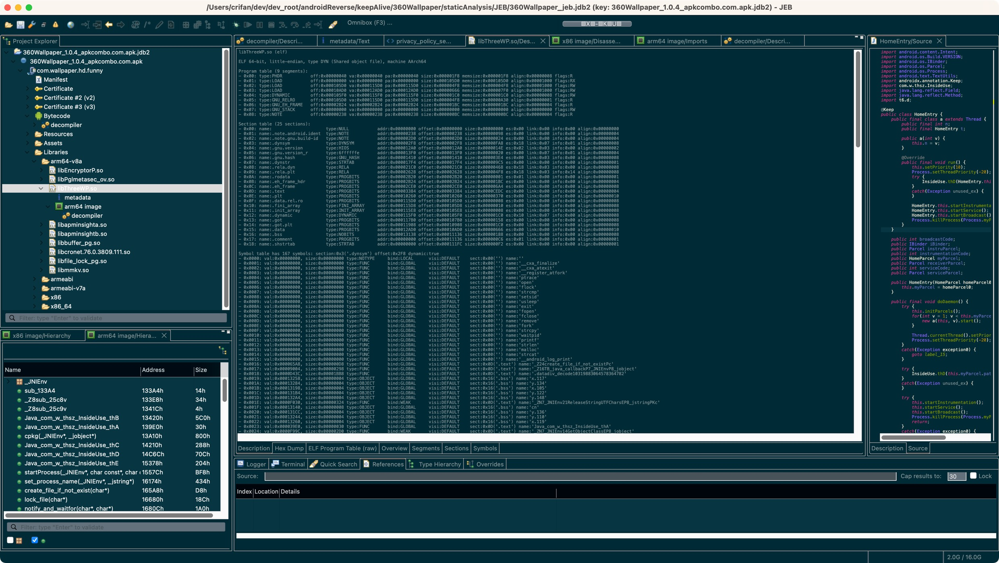
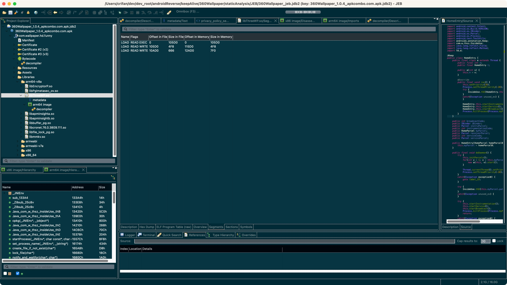
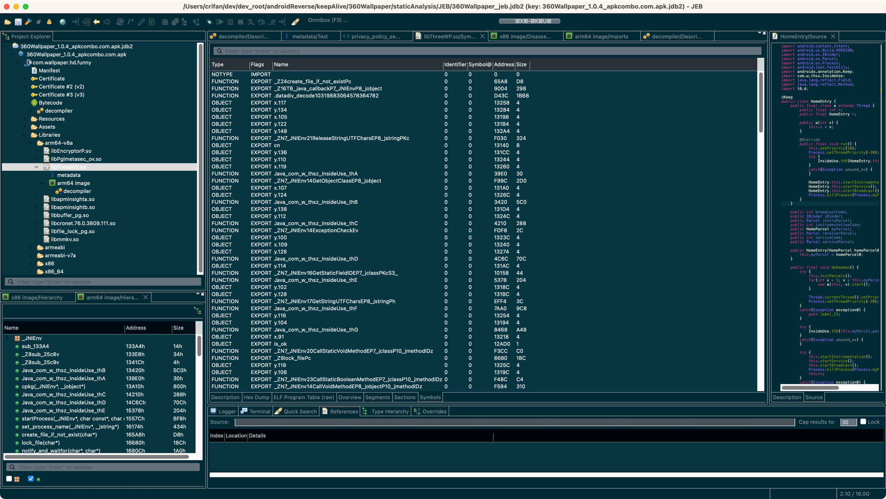

# JEB

[JEB](https://book.crifan.org/books/android_re_tool_jeb/website/)是个安卓逆向的利器。

JEB中也集成了，用于解析ELF格式的so库文件的功能。

此处列出，JEB解析ELF格式的so库文件的相关内容：

* ELF的so库文件
  * Overview
    * 
  * Description
    * 
  * ELF Program Table (raw)
    * 
  * Segements
    * 
  * Sections
    * 
  * Symbols
    * 

更多细节详见：[解析so库文件 · 安卓逆向利器：JEB](https://book.crifan.org/books/android_re_tool_jeb/website/static_analysis/decompile_apk/parse_so_lib/)
