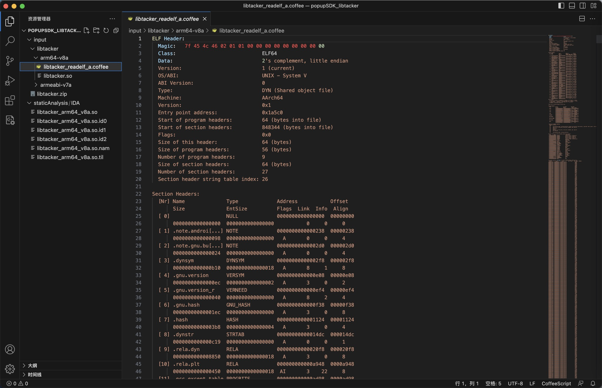
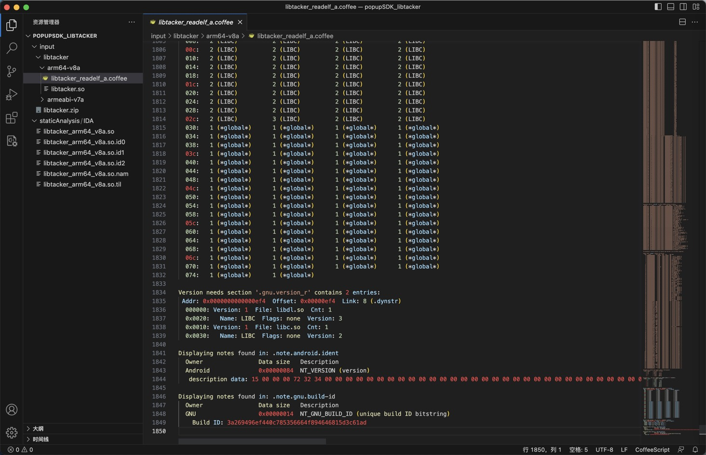

# readelf用法举例

举例说明：

* 输入文件：`libtacker.so`
  ```bash
  ➜  arm64-v8a pwd
  /Users/crifan/dev/dev_root/androidReverse/popupSDK_libtacker/input/libtacker/arm64-v8a
  ➜  arm64-v8a ll
  total 1664
  -rw-------@ 1 crifan  staff   830K  6 29 22:27 libtacker.so
  ```

readelf解析ELF格式的`libtacker.so`的具体效果如下：

## -h：显示ELF文件头信息

```bash
➜  arm64-v8a readelf -h libtacker.so
ELF Header:
  Magic:   7f 45 4c 46 02 01 01 00 00 00 00 00 00 00 00 00
  Class:                             ELF64
  Data:                              2's complement, little endian
  Version:                           1 (current)
  OS/ABI:                            UNIX - System V
  ABI Version:                       0
  Type:                              DYN (Shared object file)
  Machine:                           AArch64
  Version:                           0x1
  Entry point address:               0x1a5c0
  Start of program headers:          64 (bytes into file)
  Start of section headers:          848344 (bytes into file)
  Flags:                             0x0
  Size of this header:               64 (bytes)
  Size of program headers:           56 (bytes)
  Number of program headers:         9
  Size of section headers:           64 (bytes)
  Number of section headers:         27
  Section header string table index: 26
```

* 说明
  * Class：`ELF64`
  * Type: `DYN` (`Shared object file`)
    * 动态链接库
  * Machine: `AArch64` == `arm64`
  * Entry point address: `0x1a5c0`
    * 入口地址，应该就是之前的：`_start`入口函数
  * Number of program headers: `9`
    * 程序有9个header
  * Number of section headers: `27`
    * 有27个section header

## -l：显示程序头信息和段信息

```bash
➜  arm64-v8a readelf -l libtacker.so


Elf file type is DYN (Shared object file)
Entry point 0x1a5c0
There are 9 program headers, starting at offset 64


Program Headers:
  Type           Offset             VirtAddr           PhysAddr
                 FileSiz            MemSiz              Flags  Align
  PHDR           0x0000000000000040 0x0000000000000040 0x0000000000000040
                 0x00000000000001f8 0x00000000000001f8  R      0x8
  LOAD           0x0000000000000000 0x0000000000000000 0x0000000000000000
                 0x00000000000c9520 0x00000000000c9520  R E    0x1000
  LOAD           0x00000000000c9520 0x00000000000ca520 0x00000000000ca520
                 0x0000000000003510 0x0000000000003510  RW     0x1000
  LOAD           0x00000000000cca30 0x00000000000cea30 0x00000000000cea30
                 0x00000000000025d8 0x00000000000030b0  RW     0x1000
  DYNAMIC        0x00000000000cc618 0x00000000000cd618 0x00000000000cd618
                 0x00000000000001d0 0x00000000000001d0  RW     0x8
  GNU_RELRO      0x00000000000c9520 0x00000000000ca520 0x00000000000ca520
                 0x0000000000003510 0x0000000000003ae0  R      0x1
  GNU_EH_FRAME   0x000000000000fb2c 0x000000000000fb2c 0x000000000000fb2c
                 0x0000000000001dbc 0x0000000000001dbc  R      0x4
  GNU_STACK      0x0000000000000000 0x0000000000000000 0x0000000000000000
                 0x0000000000000000 0x0000000000000000  RW     0x0
  NOTE           0x0000000000000238 0x0000000000000238 0x0000000000000238
                 0x00000000000000bc 0x00000000000000bc  R      0x4


 Section to Segment mapping:
  Segment Sections...
   00
   01     .note.android.ident .note.gnu.build-id .dynsym .gnu.version .gnu.version_r .gnu.hash .hash .dynstr .rela.dyn .rela.plt .gcc_except_table .rodata .eh_frame_hdr .eh_frame .text .plt
   02     .data.rel.ro .fini_array .init_array .dynamic .got .got.plt
   03     .data .bss
   04     .dynamic
   05     .data.rel.ro .fini_array .init_array .dynamic .got .got.plt
   06     .eh_frame_hdr
   07
   08     .note.android.ident .note.gnu.build-id
```

* 说明
  * `PHDR`：保存程序头表 （ Program header  => PHDR）
  * `LOAD`：表示一个需要从二进制文件映射到虚拟地址空间的段，其中保存了常量数据（如字符串），程序目标代码等。
  * `DYNAMIC`：保存了由动态连接器（即INTERP段中指定的解释器）使用的信息。
  * `INTERP`：指定程序从可行性文件映射到内存之后，必须调用的解释器。它是通过链接其他库来满足未解析的引用，用于在虚拟地址空间中插入程序运行所需的动态库

## -S： 显示节的头信息

```bash
➜  arm64-v8a readelf -S libtacker.so
There are 27 section headers, starting at offset 0xcf1d8:


Section Headers:
  [Nr] Name              Type             Address           Offset
       Size              EntSize          Flags  Link  Info  Align
  [ 0]                   NULL             0000000000000000  00000000
       0000000000000000  0000000000000000           0     0     0
  [ 1] .note.androi[...] NOTE             0000000000000238  00000238
       0000000000000098  0000000000000000   A       0     0     4
  [ 2] .note.gnu.bu[...] NOTE             00000000000002d0  000002d0
       0000000000000024  0000000000000000   A       0     0     4
  [ 3] .dynsym           DYNSYM           00000000000002f8  000002f8
       0000000000000b10  0000000000000018   A       8     1     8
  [ 4] .gnu.version      VERSYM           0000000000000e08  00000e08
       00000000000000ec  0000000000000002   A       3     0     2
  [ 5] .gnu.version_r    VERNEED          0000000000000ef4  00000ef4
       0000000000000040  0000000000000000   A       8     2     4
  [ 6] .gnu.hash         GNU_HASH         0000000000000f38  00000f38
       00000000000001ec  0000000000000000   A       3     0     8
  [ 7] .hash             HASH             0000000000001124  00001124
       00000000000003b8  0000000000000004   A       3     0     4
  [ 8] .dynstr           STRTAB           00000000000014dc  000014dc
       0000000000000c19  0000000000000000   A       0     0     1
  [ 9] .rela.dyn         RELA             00000000000020f8  000020f8
       0000000000008850  0000000000000018   A       3     0     8
  [10] .rela.plt         RELA             000000000000a948  0000a948
       0000000000000450  0000000000000018  AI       3    22     8
  [11] .gcc_except_table PROGBITS         000000000000ad98  0000ad98
       0000000000001960  0000000000000000   A       0     0     4
  [12] .rodata           PROGBITS         000000000000c6f8  0000c6f8
       0000000000003434  0000000000000000 AMS       0     0     8
  [13] .eh_frame_hdr     PROGBITS         000000000000fb2c  0000fb2c
       0000000000001dbc  0000000000000000   A       0     0     4
  [14] .eh_frame         PROGBITS         00000000000118e8  000118e8
       0000000000008cd4  0000000000000000   A       0     0     8
  [15] .text             PROGBITS         000000000001a5c0  0001a5c0
       00000000000aec60  0000000000000000  AX       0     0     16
  [16] .plt              PROGBITS         00000000000c9220  000c9220
       0000000000000300  0000000000000000  AX       0     0     16
  [17] .data.rel.ro      PROGBITS         00000000000ca520  000c9520
       0000000000002eb8  0000000000000000  WA       0     0     8
  [18] .fini_array       FINI_ARRAY       00000000000cd3d8  000cc3d8
       0000000000000010  0000000000000000  WA       0     0     8
  [19] .init_array       INIT_ARRAY       00000000000cd3e8  000cc3e8
       0000000000000230  0000000000000000  WA       0     0     8
  [20] .dynamic          DYNAMIC          00000000000cd618  000cc618
       00000000000001d0  0000000000000010  WA       8     0     8
  [21] .got              PROGBITS         00000000000cd7e8  000cc7e8
       00000000000000c0  0000000000000000  WA       0     0     8
  [22] .got.plt          PROGBITS         00000000000cd8a8  000cc8a8
       0000000000000188  0000000000000000  WA       0     0     8
  [23] .data             PROGBITS         00000000000cea30  000cca30
       00000000000025d8  0000000000000000  WA       0     0     16
  [24] .bss              NOBITS           00000000000d1010  000cf008
       0000000000000ad0  0000000000000000  WA       0     0     16
  [25] .comment          PROGBITS         0000000000000000  000cf008
       00000000000000c6  0000000000000001  MS       0     0     1
  [26] .shstrtab         STRTAB           0000000000000000  000cf0ce
       0000000000000104  0000000000000000           0     0     1
Key to Flags:
  W (write), A (alloc), X (execute), M (merge), S (strings), I (info),
  L (link order), O (extra OS processing required), G (group), T (TLS),
  C (compressed), x (unknown), o (OS specific), E (exclude),
  D (mbind), p (processor specific)
```

## -r：显示重定位信息

```bash
➜  arm64-v8a readelf -r libtacker.so
。。。
0000000cd3f0  007100000101 R_AARCH64_ABS64   000000000002b930 .datadiv_decode17[...] + 0
0000000cd430  007200000101 R_AARCH64_ABS64   0000000000039464 .datadiv_decode17[...] + 0
0000000cd498  007300000101 R_AARCH64_ABS64   000000000005c790 .datadiv_decode15[...] + 0
0000000cd4b0  007400000101 R_AARCH64_ABS64   000000000005ed50 .datadiv_decode15[...] + 0
0000000cd5d8  007500000101 R_AARCH64_ABS64   00000000000a5e74 .datadiv_decode54[...] + 0

Relocation section '.rela.plt' at offset 0xa948 contains 46 entries:
  Offset          Info           Type           Sym. Value    Sym. Name + Addend
0000000cd8c0  000100000402 R_AARCH64_JUMP_SL 0000000000000000 __cxa_finalize@LIBC + 0
0000000cd8c8  000200000402 R_AARCH64_JUMP_SL 0000000000000000 __cxa_atexit@LIBC + 0
0000000cd8d0  000300000402 R_AARCH64_JUMP_SL 0000000000000000 __android_log_print + 0
0000000cd8d8  000400000402 R_AARCH64_JUMP_SL 0000000000000000 __stack_chk_fail@LIBC + 0
0000000cd8e0  000500000402 R_AARCH64_JUMP_SL 0000000000000000 memset@LIBC + 0
0000000cd8e8  000600000402 R_AARCH64_JUMP_SL 0000000000000000 strncpy@LIBC + 0
0000000cd8f0  000700000402 R_AARCH64_JUMP_SL 0000000000000000 strncat@LIBC + 0
0000000cd8f8  000800000402 R_AARCH64_JUMP_SL 0000000000000000 pthread_self@LIBC + 0
0000000cd900  000900000402 R_AARCH64_JUMP_SL 0000000000000000 malloc@LIBC + 0
0000000cd908  000a00000402 R_AARCH64_JUMP_SL 0000000000000000 free@LIBC + 0
0000000cd910  000b00000402 R_AARCH64_JUMP_SL 0000000000000000 posix_memalign@LIBC + 0
0000000cd918  000d00000402 R_AARCH64_JUMP_SL 0000000000000000 vfprintf@LIBC + 0
0000000cd920  000e00000402 R_AARCH64_JUMP_SL 0000000000000000 fputc@LIBC + 0
0000000cd928  000f00000402 R_AARCH64_JUMP_SL 0000000000000000 vasprintf@LIBC + 0
0000000cd930  001000000402 R_AARCH64_JUMP_SL 0000000000000000 android_set_abort[...]@LIBC + 0
0000000cd938  001100000402 R_AARCH64_JUMP_SL 0000000000000000 openlog@LIBC + 0
0000000cd940  001200000402 R_AARCH64_JUMP_SL 0000000000000000 syslog@LIBC + 0
0000000cd948  001300000402 R_AARCH64_JUMP_SL 0000000000000000 closelog@LIBC + 0
0000000cd950  001400000402 R_AARCH64_JUMP_SL 0000000000000000 abort@LIBC + 0
0000000cd958  001500000402 R_AARCH64_JUMP_SL 0000000000000000 strlen@LIBC + 0
0000000cd960  001600000402 R_AARCH64_JUMP_SL 0000000000000000 realloc@LIBC + 0
0000000cd968  001700000402 R_AARCH64_JUMP_SL 0000000000000000 memmove@LIBC + 0
0000000cd970  001800000402 R_AARCH64_JUMP_SL 0000000000000000 __memmove_chk@LIBC + 0
0000000cd978  001900000402 R_AARCH64_JUMP_SL 0000000000000000 __strlen_chk@LIBC + 0
0000000cd980  001a00000402 R_AARCH64_JUMP_SL 0000000000000000 memchr@LIBC + 0
0000000cd988  001b00000402 R_AARCH64_JUMP_SL 0000000000000000 __vsnprintf_chk@LIBC + 0
0000000cd990  001c00000402 R_AARCH64_JUMP_SL 0000000000000000 memcpy@LIBC + 0
0000000cd998  001d00000402 R_AARCH64_JUMP_SL 0000000000000000 pthread_mutex_lock@LIBC + 0
0000000cd9a0  001e00000402 R_AARCH64_JUMP_SL 0000000000000000 pthread_mutex_unlock@LIBC + 0
0000000cd9a8  001f00000402 R_AARCH64_JUMP_SL 0000000000000000 calloc@LIBC + 0
0000000cd9b0  002000000402 R_AARCH64_JUMP_SL 0000000000000000 strcmp@LIBC + 0
0000000cd9b8  002100000402 R_AARCH64_JUMP_SL 0000000000000000 pthread_getspecific@LIBC + 0
0000000cd9c0  002200000402 R_AARCH64_JUMP_SL 0000000000000000 pthread_once@LIBC + 0
0000000cd9c8  002300000402 R_AARCH64_JUMP_SL 0000000000000000 pthread_setspecific@LIBC + 0
0000000cd9d0  002400000402 R_AARCH64_JUMP_SL 0000000000000000 pthread_key_delete@LIBC + 0
0000000cd9d8  002500000402 R_AARCH64_JUMP_SL 0000000000000000 pthread_key_create@LIBC + 0
0000000cd9e0  002600000402 R_AARCH64_JUMP_SL 0000000000000000 getauxval@LIBC + 0
0000000cd9e8  002700000402 R_AARCH64_JUMP_SL 0000000000000000 __system_property_get@LIBC + 0
0000000cd9f0  002800000402 R_AARCH64_JUMP_SL 0000000000000000 strncmp@LIBC + 0
0000000cd9f8  002900000402 R_AARCH64_JUMP_SL 0000000000000000 fprintf@LIBC + 0
0000000cda00  002a00000402 R_AARCH64_JUMP_SL 0000000000000000 fflush@LIBC + 0
0000000cda08  002b00000402 R_AARCH64_JUMP_SL 0000000000000000 pthread_rwlock_wrlock@LIBC + 0
0000000cda10  002c00000402 R_AARCH64_JUMP_SL 0000000000000000 pthread_rwlock_unlock@LIBC + 0
0000000cda18  002d00000402 R_AARCH64_JUMP_SL 0000000000000000 dl_iterate_phdr@LIBC + 0
0000000cda20  002e00000402 R_AARCH64_JUMP_SL 0000000000000000 pthread_rwlock_rdlock@LIBC + 0
0000000cda28  002f00000402 R_AARCH64_JUMP_SL 0000000000000000 fwrite@LIBC + 0
```

看出来了，前面的：

* -r --relocs            Display the relocations (if present)
  * 输出：
    * Relocation section '.rela.dyn' at offset 0x20f8 contains 1454 entries
    * Relocation section '.rela.plt' at offset 0xa948 contains 46 entries == Imports

## -s：显示符号表

```bash
Symbol table '.dynsym' contains 118 entries:
   Num:    Value          Size Type    Bind   Vis      Ndx Name
     0: 0000000000000000     0 NOTYPE  LOCAL  DEFAULT  UND 
     1: 0000000000000000     0 FUNC    GLOBAL DEFAULT  UND __cxa_f[...]@LIBC (2)
     2: 0000000000000000     0 FUNC    GLOBAL DEFAULT  UND __cxa_atexit@LIBC (2)
     3: 0000000000000000     0 FUNC    GLOBAL DEFAULT  UND __android_log_print
     4: 0000000000000000     0 FUNC    GLOBAL DEFAULT  UND __stack[...]@LIBC (2)
     5: 0000000000000000     0 FUNC    GLOBAL DEFAULT  UND memset@LIBC (2)
     6: 0000000000000000     0 FUNC    GLOBAL DEFAULT  UND strncpy@LIBC (2)
     7: 0000000000000000     0 FUNC    GLOBAL DEFAULT  UND strncat@LIBC (2)
     8: 0000000000000000     0 FUNC    GLOBAL DEFAULT  UND pthread_self@LIBC (2)
     9: 0000000000000000     0 FUNC    GLOBAL DEFAULT  UND malloc@LIBC (2)
    10: 0000000000000000     0 FUNC    GLOBAL DEFAULT  UND free@LIBC (2)
    11: 0000000000000000     0 FUNC    GLOBAL DEFAULT  UND posix_m[...]@LIBC (2)
    12: 0000000000000000     0 OBJECT  GLOBAL DEFAULT  UND __sF@LIBC (2)
    13: 0000000000000000     0 FUNC    GLOBAL DEFAULT  UND vfprintf@LIBC (2)
    14: 0000000000000000     0 FUNC    GLOBAL DEFAULT  UND fputc@LIBC (2)
    15: 0000000000000000     0 FUNC    GLOBAL DEFAULT  UND vasprintf@LIBC (2)
    16: 0000000000000000     0 FUNC    GLOBAL DEFAULT  UND android[...]@LIBC (2)
    17: 0000000000000000     0 FUNC    GLOBAL DEFAULT  UND openlog@LIBC (2)
    18: 0000000000000000     0 FUNC    GLOBAL DEFAULT  UND syslog@LIBC (2)
    19: 0000000000000000     0 FUNC    GLOBAL DEFAULT  UND closelog@LIBC (2)
    20: 0000000000000000     0 FUNC    GLOBAL DEFAULT  UND abort@LIBC (2)
    21: 0000000000000000     0 FUNC    GLOBAL DEFAULT  UND strlen@LIBC (2)
    22: 0000000000000000     0 FUNC    GLOBAL DEFAULT  UND realloc@LIBC (2)
    23: 0000000000000000     0 FUNC    GLOBAL DEFAULT  UND memmove@LIBC (2)
    24: 0000000000000000     0 FUNC    GLOBAL DEFAULT  UND __memmo[...]@LIBC (2)
    25: 0000000000000000     0 FUNC    GLOBAL DEFAULT  UND __strlen_chk@LIBC (2)
    26: 0000000000000000     0 FUNC    GLOBAL DEFAULT  UND memchr@LIBC (2)
    27: 0000000000000000     0 FUNC    GLOBAL DEFAULT  UND __vsnpr[...]@LIBC (2)
    28: 0000000000000000     0 FUNC    GLOBAL DEFAULT  UND memcpy@LIBC (2)
    29: 0000000000000000     0 FUNC    GLOBAL DEFAULT  UND pthread[...]@LIBC (2)
    30: 0000000000000000     0 FUNC    GLOBAL DEFAULT  UND pthread[...]@LIBC (2)
    31: 0000000000000000     0 FUNC    GLOBAL DEFAULT  UND calloc@LIBC (2)
    32: 0000000000000000     0 FUNC    GLOBAL DEFAULT  UND strcmp@LIBC (2)
    33: 0000000000000000     0 FUNC    GLOBAL DEFAULT  UND pthread[...]@LIBC (2)
    34: 0000000000000000     0 FUNC    GLOBAL DEFAULT  UND pthread_once@LIBC (2)
    35: 0000000000000000     0 FUNC    GLOBAL DEFAULT  UND pthread[...]@LIBC (2)
    36: 0000000000000000     0 FUNC    GLOBAL DEFAULT  UND pthread[...]@LIBC (2)
    37: 0000000000000000     0 FUNC    GLOBAL DEFAULT  UND pthread[...]@LIBC (2)
    38: 0000000000000000     0 FUNC    GLOBAL DEFAULT  UND getauxval@LIBC (2)
    39: 0000000000000000     0 FUNC    GLOBAL DEFAULT  UND __syste[...]@LIBC (2)
    40: 0000000000000000     0 FUNC    GLOBAL DEFAULT  UND strncmp@LIBC (2)
    41: 0000000000000000     0 FUNC    GLOBAL DEFAULT  UND fprintf@LIBC (2)
    42: 0000000000000000     0 FUNC    GLOBAL DEFAULT  UND fflush@LIBC (2)
    43: 0000000000000000     0 FUNC    GLOBAL DEFAULT  UND pthread[...]@LIBC (2)
    44: 0000000000000000     0 FUNC    GLOBAL DEFAULT  UND pthread[...]@LIBC (2)
    45: 0000000000000000     0 FUNC    GLOBAL DEFAULT  UND dl_iter[...]@LIBC (3)
    46: 0000000000000000     0 FUNC    GLOBAL DEFAULT  UND pthread[...]@LIBC (2)
    47: 0000000000000000     0 FUNC    GLOBAL DEFAULT  UND fwrite@LIBC (2)
    48: 0000000000044ce8  6608 FUNC    GLOBAL DEFAULT   15 .datadiv_decode1[...]
    49: 0000000000078a04  2696 FUNC    GLOBAL DEFAULT   15 .datadiv_decode9[...]
    50: 00000000000a8a58  3892 FUNC    GLOBAL DEFAULT   15 .datadiv_decode1[...]
    51: 0000000000076128  2160 FUNC    GLOBAL DEFAULT   15 .datadiv_decode4[...]
    52: 000000000008f8e8  8740 FUNC    GLOBAL DEFAULT   15 .datadiv_decode9[...]
...
    70: 000000000008e650  3772 FUNC    GLOBAL DEFAULT   15 .datadiv_decode1[...]
    71: 00000000000381fc  3696 FUNC    GLOBAL DEFAULT   15 .datadiv_decode3[...]
    72: 000000000006f220  3892 FUNC    GLOBAL DEFAULT   15 .datadiv_decode8[...]
    73: 00000000000a8884     4 FUNC    GLOBAL DEFAULT   15 .datadiv_decode1[...]
    74: 00000000000aa438  1436 FUNC    GLOBAL DEFAULT   15 JNI_OnLoad
    75: 0000000000026d98 18656 FUNC    GLOBAL DEFAULT   15 .datadiv_decode1[...]
    76: 0000000000033a2c 11972 FUNC    GLOBAL DEFAULT   15 .datadiv_decode1[...]
...
   116: 000000000005ed50  6304 FUNC    GLOBAL DEFAULT   15 .datadiv_decode1[...]
   117: 00000000000a5e74     4 FUNC    GLOBAL DEFAULT   15 .datadiv_decode5[...]
```


## -sV：显示符号表且带版本信息

```bash
  -s --syms              Display the symbol table
  -V --version-info      Display the version sections (if present)
```

->

```bash
➜  arm64-v8a readelf -sV libtacker.so


Symbol table '.dynsym' contains 118 entries:
   Num:    Value          Size Type    Bind   Vis      Ndx Name
     0: 0000000000000000     0 NOTYPE  LOCAL  DEFAULT  UND
     1: 0000000000000000     0 FUNC    GLOBAL DEFAULT  UND __cxa_f[...]@LIBC (2)
     2: 0000000000000000     0 FUNC    GLOBAL DEFAULT  UND __cxa_atexit@LIBC (2)
     3: 0000000000000000     0 FUNC    GLOBAL DEFAULT  UND __android_log_print
     4: 0000000000000000     0 FUNC    GLOBAL DEFAULT  UND __stack[...]@LIBC (2)
     5: 0000000000000000     0 FUNC    GLOBAL DEFAULT  UND memset@LIBC (2)
     6: 0000000000000000     0 FUNC    GLOBAL DEFAULT  UND strncpy@LIBC (2)
     7: 0000000000000000     0 FUNC    GLOBAL DEFAULT  UND strncat@LIBC (2)
     8: 0000000000000000     0 FUNC    GLOBAL DEFAULT  UND pthread_self@LIBC (2)
     9: 0000000000000000     0 FUNC    GLOBAL DEFAULT  UND malloc@LIBC (2)
    10: 0000000000000000     0 FUNC    GLOBAL DEFAULT  UND free@LIBC (2)
    11: 0000000000000000     0 FUNC    GLOBAL DEFAULT  UND posix_m[...]@LIBC (2)
    12: 0000000000000000     0 OBJECT  GLOBAL DEFAULT  UND __sF@LIBC (2)
    13: 0000000000000000     0 FUNC    GLOBAL DEFAULT  UND vfprintf@LIBC (2)
    14: 0000000000000000     0 FUNC    GLOBAL DEFAULT  UND fputc@LIBC (2)
    15: 0000000000000000     0 FUNC    GLOBAL DEFAULT  UND vasprintf@LIBC (2)
    16: 0000000000000000     0 FUNC    GLOBAL DEFAULT  UND android[...]@LIBC (2)
    17: 0000000000000000     0 FUNC    GLOBAL DEFAULT  UND openlog@LIBC (2)
    18: 0000000000000000     0 FUNC    GLOBAL DEFAULT  UND syslog@LIBC (2)
    19: 0000000000000000     0 FUNC    GLOBAL DEFAULT  UND closelog@LIBC (2)
    20: 0000000000000000     0 FUNC    GLOBAL DEFAULT  UND abort@LIBC (2)
    21: 0000000000000000     0 FUNC    GLOBAL DEFAULT  UND strlen@LIBC (2)
    22: 0000000000000000     0 FUNC    GLOBAL DEFAULT  UND realloc@LIBC (2)
    23: 0000000000000000     0 FUNC    GLOBAL DEFAULT  UND memmove@LIBC (2)
    24: 0000000000000000     0 FUNC    GLOBAL DEFAULT  UND __memmo[...]@LIBC (2)
    25: 0000000000000000     0 FUNC    GLOBAL DEFAULT  UND __strlen_chk@LIBC (2)
    26: 0000000000000000     0 FUNC    GLOBAL DEFAULT  UND memchr@LIBC (2)
    27: 0000000000000000     0 FUNC    GLOBAL DEFAULT  UND __vsnpr[...]@LIBC (2)
    28: 0000000000000000     0 FUNC    GLOBAL DEFAULT  UND memcpy@LIBC (2)
    29: 0000000000000000     0 FUNC    GLOBAL DEFAULT  UND pthread[...]@LIBC (2)
    30: 0000000000000000     0 FUNC    GLOBAL DEFAULT  UND pthread[...]@LIBC (2)
    31: 0000000000000000     0 FUNC    GLOBAL DEFAULT  UND calloc@LIBC (2)
    32: 0000000000000000     0 FUNC    GLOBAL DEFAULT  UND strcmp@LIBC (2)
    33: 0000000000000000     0 FUNC    GLOBAL DEFAULT  UND pthread[...]@LIBC (2)
    34: 0000000000000000     0 FUNC    GLOBAL DEFAULT  UND pthread_once@LIBC (2)
    35: 0000000000000000     0 FUNC    GLOBAL DEFAULT  UND pthread[...]@LIBC (2)
    36: 0000000000000000     0 FUNC    GLOBAL DEFAULT  UND pthread[...]@LIBC (2)
    37: 0000000000000000     0 FUNC    GLOBAL DEFAULT  UND pthread[...]@LIBC (2)
    38: 0000000000000000     0 FUNC    GLOBAL DEFAULT  UND getauxval@LIBC (2)
    39: 0000000000000000     0 FUNC    GLOBAL DEFAULT  UND __syste[...]@LIBC (2)
    40: 0000000000000000     0 FUNC    GLOBAL DEFAULT  UND strncmp@LIBC (2)
    41: 0000000000000000     0 FUNC    GLOBAL DEFAULT  UND fprintf@LIBC (2)
    42: 0000000000000000     0 FUNC    GLOBAL DEFAULT  UND fflush@LIBC (2)
    43: 0000000000000000     0 FUNC    GLOBAL DEFAULT  UND pthread[...]@LIBC (2)
    44: 0000000000000000     0 FUNC    GLOBAL DEFAULT  UND pthread[...]@LIBC (2)
    45: 0000000000000000     0 FUNC    GLOBAL DEFAULT  UND dl_iter[...]@LIBC (3)
    46: 0000000000000000     0 FUNC    GLOBAL DEFAULT  UND pthread[...]@LIBC (2)
    47: 0000000000000000     0 FUNC    GLOBAL DEFAULT  UND fwrite@LIBC (2)
    48: 0000000000044ce8  6608 FUNC    GLOBAL DEFAULT   15 .datadiv_decode1[...]
    49: 0000000000078a04  2696 FUNC    GLOBAL DEFAULT   15 .datadiv_decode9[...]
    50: 00000000000a8a58  3892 FUNC    GLOBAL DEFAULT   15 .datadiv_decode1[...]
    51: 0000000000076128  2160 FUNC    GLOBAL DEFAULT   15 .datadiv_decode4[...]
    52: 000000000008f8e8  8740 FUNC    GLOBAL DEFAULT   15 .datadiv_decode9[...]
    53: 00000000000523ec 10992 FUNC    GLOBAL DEFAULT   15 .datadiv_decode1[...]
    54: 0000000000055f24 26664 FUNC    GLOBAL DEFAULT   15 .datadiv_decode3[...]
    55: 000000000005ca48  6228 FUNC    GLOBAL DEFAULT   15 .datadiv_decode8[...]
    56: 0000000000072b58 13248 FUNC    GLOBAL DEFAULT   15 .datadiv_decode6[...]
    57: 000000000009f204  6296 FUNC    GLOBAL DEFAULT   15 .datadiv_decode5[...]
    58: 0000000000032490  4596 FUNC    GLOBAL DEFAULT   15 .datadiv_decode1[...]
    59: 00000000000642dc 21616 FUNC    GLOBAL DEFAULT   15 .datadiv_decode1[...]
    60: 000000000007eb38     4 FUNC    GLOBAL DEFAULT   15 .datadiv_decode1[...]
    61: 0000000000091c0c  3612 FUNC    GLOBAL DEFAULT   15 .datadiv_decode1[...]
    62: 0000000000099d00  3748 FUNC    GLOBAL DEFAULT   15 .datadiv_decode1[...]
    63: 000000000004a620 24816 FUNC    GLOBAL DEFAULT   15 .datadiv_decode1[...]
    64: 0000000000079c64 15120 FUNC    GLOBAL DEFAULT   15 .datadiv_decode9[...]
    65: 0000000000089d58  8212 FUNC    GLOBAL DEFAULT   15 .datadiv_decode1[...]
    66: 000000000009bf84     4 FUNC    GLOBAL DEFAULT   15 .datadiv_decode8[...]
    67: 000000000007ee60  7596 FUNC    GLOBAL DEFAULT   15 .datadiv_decode5[...]
    68: 0000000000083388 16340 FUNC    GLOBAL DEFAULT   15 .datadiv_decode1[...]
    69: 00000000000890a8  2684 FUNC    GLOBAL DEFAULT   15 .datadiv_decode1[...]
    70: 000000000008e650  3772 FUNC    GLOBAL DEFAULT   15 .datadiv_decode1[...]
    71: 00000000000381fc  3696 FUNC    GLOBAL DEFAULT   15 .datadiv_decode3[...]
    72: 000000000006f220  3892 FUNC    GLOBAL DEFAULT   15 .datadiv_decode8[...]
    73: 00000000000a8884     4 FUNC    GLOBAL DEFAULT   15 .datadiv_decode1[...]
    74: 00000000000aa438  1436 FUNC    GLOBAL DEFAULT   15 JNI_OnLoad
    75: 0000000000026d98 18656 FUNC    GLOBAL DEFAULT   15 .datadiv_decode1[...]
    76: 0000000000033a2c 11972 FUNC    GLOBAL DEFAULT   15 .datadiv_decode1[...]
    77: 000000000003c8dc  8072 FUNC    GLOBAL DEFAULT   15 .datadiv_decode5[...]
    78: 00000000000783f8  1112 FUNC    GLOBAL DEFAULT   15 .datadiv_decode1[...]
    79: 00000000000402e0 18000 FUNC    GLOBAL DEFAULT   15 .datadiv_decode1[...]
    80: 0000000000050d58  3556 FUNC    GLOBAL DEFAULT   15 .datadiv_decode1[...]
    81: 00000000000a0f34 12764 FUNC    GLOBAL DEFAULT   15 .datadiv_decode1[...]
    82: 000000000002fa98  1716 FUNC    GLOBAL DEFAULT   15 .datadiv_decode8[...]
    83: 0000000000050850  1052 FUNC    GLOBAL DEFAULT   15 .datadiv_decode5[...]
    84: 000000000005e3ac  1512 FUNC    GLOBAL DEFAULT   15 .datadiv_decode1[...]
    85: 000000000007058c  8700 FUNC    GLOBAL DEFAULT   15 .datadiv_decode1[...]
    86: 0000000000076aa0  5588 FUNC    GLOBAL DEFAULT   15 .datadiv_decode1[...]
    87: 000000000007d9ac  4264 FUNC    GLOBAL DEFAULT   15 .datadiv_decode1[...]
    88: 0000000000092dc0  6148 FUNC    GLOBAL DEFAULT   15 .datadiv_decode1[...]
    89: 000000000002e2bc  5636 FUNC    GLOBAL DEFAULT   15 .datadiv_decode1[...]
    90: 000000000007eac4     4 FUNC    GLOBAL DEFAULT   15 .datadiv_decode1[...]
    91: 0000000000087514  6800 FUNC    GLOBAL DEFAULT   15 .datadiv_decode4[...]
    92: 00000000000a4228  1888 FUNC    GLOBAL DEFAULT   15 .datadiv_decode6[...]
    93: 00000000000a6a74  7124 FUNC    GLOBAL DEFAULT   15 .datadiv_decode8[...]
    94: 0000000000046ba4 12236 FUNC    GLOBAL DEFAULT   15 .datadiv_decode1[...]
    95: 0000000000080db8  7204 FUNC    GLOBAL DEFAULT   15 .datadiv_decode1[...]
    96: 000000000008bfc4  4784 FUNC    GLOBAL DEFAULT   15 .datadiv_decode1[...]
    97: 0000000000094aac 10132 FUNC    GLOBAL DEFAULT   15 .datadiv_decode1[...]
    98: 000000000003b9c0  2832 FUNC    GLOBAL DEFAULT   15 .datadiv_decode1[...]
    99: 000000000006a31c 19572 FUNC    GLOBAL DEFAULT   15 .datadiv_decode1[...]
   100: 000000000008d4fc  3852 FUNC    GLOBAL DEFAULT   15 .datadiv_decode6[...]
   101: 000000000009af44  4076 FUNC    GLOBAL DEFAULT   15 .datadiv_decode1[...]
   102: 00000000000aa164     4 FUNC    GLOBAL DEFAULT   15 .datadiv_decode8[...]
   103: 0000000000030db4  5388 FUNC    GLOBAL DEFAULT   15 .datadiv_decode8[...]
   104: 0000000000060904 10444 FUNC    GLOBAL DEFAULT   15 .datadiv_decode2[...]
   105: 00000000000979f8  8736 FUNC    GLOBAL DEFAULT   15 .datadiv_decode2[...]
   106: 000000000009c3ec 11308 FUNC    GLOBAL DEFAULT   15 .datadiv_decode1[...]
   107: 00000000000a4be8  4636 FUNC    GLOBAL DEFAULT   15 .datadiv_decode1[...]
   108: 00000000000a5f84  2352 FUNC    GLOBAL DEFAULT   15 .datadiv_decode5[...]
   109: 00000000000aa9d4  5616 FUNC    GLOBAL DEFAULT   15 .datadiv_decode2[...]
   110: 0000000000036ab8  3832 FUNC    GLOBAL DEFAULT   15 .datadiv_decode1[...]
   111: 000000000003b2ac     4 FUNC    GLOBAL DEFAULT   15 .datadiv_decode1[...]
   112: 000000000003b8fc     4 FUNC    GLOBAL DEFAULT   15 .datadiv_decode7[...]
   113: 000000000002b930 10168 FUNC    GLOBAL DEFAULT   15 .datadiv_decode1[...]
   114: 0000000000039464  7640 FUNC    GLOBAL DEFAULT   15 .datadiv_decode1[...]
   115: 000000000005c790     4 FUNC    GLOBAL DEFAULT   15 .datadiv_decode1[...]
   116: 000000000005ed50  6304 FUNC    GLOBAL DEFAULT   15 .datadiv_decode1[...]
   117: 00000000000a5e74     4 FUNC    GLOBAL DEFAULT   15 .datadiv_decode5[...]


Version symbols section '.gnu.version' contains 118 entries:
 Addr: 0x0000000000000e08  Offset: 0x00000e08  Link: 3 (.dynsym)
  000:   0 (*local*)       2 (LIBC)          2 (LIBC)          1 (*global*)
  004:   2 (LIBC)          2 (LIBC)          2 (LIBC)          2 (LIBC)
  008:   2 (LIBC)          2 (LIBC)          2 (LIBC)          2 (LIBC)
  00c:   2 (LIBC)          2 (LIBC)          2 (LIBC)          2 (LIBC)
  010:   2 (LIBC)          2 (LIBC)          2 (LIBC)          2 (LIBC)
  014:   2 (LIBC)          2 (LIBC)          2 (LIBC)          2 (LIBC)
  018:   2 (LIBC)          2 (LIBC)          2 (LIBC)          2 (LIBC)
  01c:   2 (LIBC)          2 (LIBC)          2 (LIBC)          2 (LIBC)
  020:   2 (LIBC)          2 (LIBC)          2 (LIBC)          2 (LIBC)
  024:   2 (LIBC)          2 (LIBC)          2 (LIBC)          2 (LIBC)
  028:   2 (LIBC)          2 (LIBC)          2 (LIBC)          2 (LIBC)
  02c:   2 (LIBC)          3 (LIBC)          2 (LIBC)          2 (LIBC)
  030:   1 (*global*)      1 (*global*)      1 (*global*)      1 (*global*)
  034:   1 (*global*)      1 (*global*)      1 (*global*)      1 (*global*)
  038:   1 (*global*)      1 (*global*)      1 (*global*)      1 (*global*)
  03c:   1 (*global*)      1 (*global*)      1 (*global*)      1 (*global*)
  040:   1 (*global*)      1 (*global*)      1 (*global*)      1 (*global*)
  044:   1 (*global*)      1 (*global*)      1 (*global*)      1 (*global*)
  048:   1 (*global*)      1 (*global*)      1 (*global*)      1 (*global*)
  04c:   1 (*global*)      1 (*global*)      1 (*global*)      1 (*global*)
  050:   1 (*global*)      1 (*global*)      1 (*global*)      1 (*global*)
  054:   1 (*global*)      1 (*global*)      1 (*global*)      1 (*global*)
  058:   1 (*global*)      1 (*global*)      1 (*global*)      1 (*global*)
  05c:   1 (*global*)      1 (*global*)      1 (*global*)      1 (*global*)
  060:   1 (*global*)      1 (*global*)      1 (*global*)      1 (*global*)
  064:   1 (*global*)      1 (*global*)      1 (*global*)      1 (*global*)
  068:   1 (*global*)      1 (*global*)      1 (*global*)      1 (*global*)
  06c:   1 (*global*)      1 (*global*)      1 (*global*)      1 (*global*)
  070:   1 (*global*)      1 (*global*)      1 (*global*)      1 (*global*)
  074:   1 (*global*)      1 (*global*)


Version needs section '.gnu.version_r' contains 2 entries:
 Addr: 0x0000000000000ef4  Offset: 0x00000ef4  Link: 8 (.dynstr)
  000000: Version: 1  File: libdl.so  Cnt: 1
  0x0020:   Name: LIBC  Flags: none  Version: 3
  0x0010: Version: 1  File: libc.so  Cnt: 1
  0x0030:   Name: LIBC  Flags: none  Version: 2
```

比普通的`-s`，多出了版本信息：

* .gnu.version
* .gnu.version_r

## -x：以hex方式打印信息

### 举例1

对于：

```bash
Section Headers:
  [Nr] Name              Type             Address           Offset
       Size              EntSize          Flags  Link  Info  Align
...
  [ 3] .dynsym           DYNSYM           00000000000002f8  000002f8
       0000000000000b10  0000000000000018   A       8     1     8
```

中的：

* `[ 3] .dynsym`

去打印信息：

```bash
➜  arm64-v8a readelf -x .dynsym libtacker.so

Hex dump of section '.dynsym':
  0x000002f8 00000000 00000000 00000000 00000000 ................
  0x00000308 00000000 00000000 01000000 12000000 ................
  0x00000318 00000000 00000000 00000000 00000000 ................
  0x00000328 10000000 12000000 00000000 00000000 ................
  0x00000338 00000000 00000000 1d000000 12000000 ................
  0x00000348 00000000 00000000 00000000 00000000 ................
  0x00000358 31000000 12000000 00000000 00000000 1...............
  0x00000368 00000000 00000000 34020000 12000000 ........4.......
  0x00000378 00000000 00000000 00000000 00000000 ................
  0x00000388 3b020000 12000000 00000000 00000000 ;...............
  0x00000398 00000000 00000000 43020000 12000000 ........C.......
  0x000003a8 00000000 00000000 00000000 00000000 ................
  0x000003b8 81090000 12000000 00000000 00000000 ................
  0x000003c8 00000000 00000000 030a0000 12000000 ................
  0x000003d8 00000000 00000000 00000000 00000000 ................
  0x000003e8 0a0a0000 12000000 00000000 00000000 ................
  0x000003f8 00000000 00000000 0f0a0000 12000000 ................
  0x00000408 00000000 00000000 00000000 00000000 ................
  0x00000418 1e0a0000 11000000 00000000 00000000 ................
  0x00000428 00000000 00000000 230a0000 12000000 ........#.......
  0x00000438 00000000 00000000 00000000 00000000 ................
  0x00000448 2c0a0000 12000000 00000000 00000000 ,...............
  0x00000458 00000000 00000000 320a0000 12000000 ........2.......
  0x00000468 00000000 00000000 00000000 00000000 ................
  0x00000478 3c0a0000 12000000 00000000 00000000 <...............
  0x00000488 00000000 00000000 560a0000 12000000 ........V.......
  0x00000498 00000000 00000000 00000000 00000000 ................
  0x000004a8 5e0a0000 12000000 00000000 00000000 ^...............
  0x000004b8 00000000 00000000 650a0000 12000000 ........e.......
  0x000004c8 00000000 00000000 00000000 00000000 ................
  0x000004d8 6e0a0000 12000000 00000000 00000000 n...............
  0x000004e8 00000000 00000000 740a0000 12000000 ........t.......
  0x000004f8 00000000 00000000 00000000 00000000 ................
  0x00000508 7b0a0000 12000000 00000000 00000000 {...............
  0x00000518 00000000 00000000 830a0000 12000000 ................
  0x00000528 00000000 00000000 00000000 00000000 ................
  0x00000538 8b0a0000 12000000 00000000 00000000 ................
  0x00000548 00000000 00000000 990a0000 12000000 ................
  0x00000558 00000000 00000000 00000000 00000000 ................
  0x00000568 a60a0000 12000000 00000000 00000000 ................
  0x00000578 00000000 00000000 ad0a0000 12000000 ................
  0x00000588 00000000 00000000 00000000 00000000 ................
  0x00000598 bd0a0000 12000000 00000000 00000000 ................
  0x000005a8 00000000 00000000 c40a0000 12000000 ................
  0x000005b8 00000000 00000000 00000000 00000000 ................
  0x000005c8 d70a0000 12000000 00000000 00000000 ................
  0x000005d8 00000000 00000000 ec0a0000 12000000 ................
  0x000005e8 00000000 00000000 00000000 00000000 ................
  0x000005f8 f30a0000 12000000 00000000 00000000 ................
  0x00000608 00000000 00000000 fa0a0000 12000000 ................
  0x00000618 00000000 00000000 00000000 00000000 ................
  0x00000628 0e0b0000 12000000 00000000 00000000 ................
  0x00000638 00000000 00000000 1b0b0000 12000000 ................
  0x00000648 00000000 00000000 00000000 00000000 ................
  0x00000658 2f0b0000 12000000 00000000 00000000 /...............
  0x00000668 00000000 00000000 420b0000 12000000 ........B.......
  0x00000678 00000000 00000000 00000000 00000000 ................
  0x00000688 550b0000 12000000 00000000 00000000 U...............
  0x00000698 00000000 00000000 5f0b0000 12000000 ........_.......
  0x000006a8 00000000 00000000 00000000 00000000 ................
  0x000006b8 750b0000 12000000 00000000 00000000 u...............
  0x000006c8 00000000 00000000 7d0b0000 12000000 ........}.......
  0x000006d8 00000000 00000000 00000000 00000000 ................
  0x000006e8 850b0000 12000000 00000000 00000000 ................
  0x000006f8 00000000 00000000 8c0b0000 12000000 ................
  0x00000708 00000000 00000000 00000000 00000000 ................
  0x00000718 a20b0000 12000000 00000000 00000000 ................
  0x00000728 00000000 00000000 b80b0000 12000000 ................
  0x00000738 00000000 00000000 00000000 00000000 ................
  0x00000748 c80b0000 12000000 00000000 00000000 ................
  0x00000758 00000000 00000000 de0b0000 12000000 ................
  0x00000768 00000000 00000000 00000000 00000000 ................
  0x00000778 6f020000 12000f00 e84c0400 00000000 o........L......
  0x00000788 d0190000 00000000 37050000 12000f00 ........7.......
  0x00000798 048a0700 00000000 880a0000 00000000 ................
  0x000007a8 8e090000 12000f00 588a0a00 00000000 ........X.......
  0x000007b8 340f0000 00000000 cc040000 12000f00 4...............
  0x000007c8 28610700 00000000 70080000 00000000 (a......p.......
  0x000007d8 29070000 12000f00 e8f80800 00000000 )...............
  0x000007e8 24220000 00000000 22030000 12000f00 $"......".......
  0x000007f8 ec230500 00000000 f02a0000 00000000 .#.......*......
  0x00000808 46030000 12000f00 245f0500 00000000 F.......$_......
  0x00000818 28680000 00000000 8c030000 12000f00 (h..............
  0x00000828 48ca0500 00000000 54180000 00000000 H.......T.......
  0x00000838 a9040000 12000f00 582b0700 00000000 ........X+......
  0x00000848 c0330000 00000000 67080000 12000f00 .3......g.......
  0x00000858 04f20900 00000000 98180000 00000000 ................
  0x00000868 f4000000 12000f00 90240300 00000000 .........$......
  0x00000878 f4110000 00000000 1a040000 12000f00 ................
  0x00000888 dc420600 00000000 70540000 00000000 .B......pT......
  0x00000898 c5050000 12000f00 38eb0700 00000000 ........8.......
  0x000008a8 04000000 00000000 4c070000 12000f00 ........L.......
  0x000008b8 0c1c0900 00000000 1c0e0000 00000000 ................
  0x000008c8 d8070000 12000f00 009d0900 00000000 ................
  0x000008d8 a40e0000 00000000 b7020000 12000f00 ................
  0x000008e8 20a60400 00000000 f0600000 00000000  ........`......
  0x000008f8 5a050000 12000f00 649c0700 00000000 Z.......d.......
  0x00000908 103b0000 00000000 9a060000 12000f00 .;..............
  0x00000918 589d0800 00000000 14200000 00000000 X........ ......
  0x00000928 20080000 12000f00 84bf0900 00000000  ...............
  0x00000938 04000000 00000000 e9050000 12000f00 ................
  0x00000948 60ee0700 00000000 ac1d0000 00000000 `...............
  0x00000958 2f060000 12000f00 88330800 00000000 /........3......
  0x00000968 d43f0000 00000000 76060000 12000f00 .?......v.......
  0x00000978 a8900800 00000000 7c0a0000 00000000 ........|.......
  0x00000988 05070000 12000f00 50e60800 00000000 ........P.......
  0x00000998 bc0e0000 00000000 60010000 12000f00 ........`.......
  0x000009a8 fc810300 00000000 700e0000 00000000 ........p.......
  0x000009b8 62040000 12000f00 20f20600 00000000 b....... .......
  0x000009c8 340f0000 00000000 5d090000 12000f00 4.......].......
  0x000009d8 84880a00 00000000 04000000 00000000 ................
  0x000009e8 d5090000 12000f00 38a40a00 00000000 ........8.......
  0x000009f8 9c050000 00000000 42000000 12000f00 ........B.......
  0x00000a08 986d0200 00000000 e0480000 00000000 .m.......H......
  0x00000a18 18010000 12000f00 2c3a0300 00000000 ........,:......
  0x00000a28 c42e0000 00000000 11020000 12000f00 ................
  0x00000a38 dcc80300 00000000 881f0000 00000000 ................
  0x00000a48 13050000 12000f00 f8830700 00000000 ................
  0x00000a58 58040000 00000000 4b020000 12000f00 X.......K.......
  0x00000a68 e0020400 00000000 50460000 00000000 ........PF......
  0x00000a78 fe020000 12000f00 580d0500 00000000 ........X.......
  0x00000a88 e40d0000 00000000 8a080000 12000f00 ................
  0x00000a98 340f0a00 00000000 dc310000 00000000 4........1......
  0x00000aa8 ae000000 12000f00 98fa0200 00000000 ................
  0x00000ab8 b4060000 00000000 db020000 12000f00 ................
  0x00000ac8 50080500 00000000 1c040000 00000000 P...............
  0x00000ad8 af030000 12000f00 ace30500 00000000 ................
  0x00000ae8 e8050000 00000000 85040000 12000f00 ................
  0x00000af8 8c050700 00000000 fc210000 00000000 .........!......
  0x00000b08 ef040000 12000f00 a06a0700 00000000 .........j......
  0x00000b18 d4150000 00000000 7d050000 12000f00 ........}.......
  0x00000b28 acd90700 00000000 a8100000 00000000 ................
  0x00000b38 6e070000 12000f00 c02d0900 00000000 n........-......
  0x00000b48 04180000 00000000 8a000000 12000f00 ................
  0x00000b58 bce20200 00000000 04160000 00000000 ................
  0x00000b68 a1050000 12000f00 c4ea0700 00000000 ................
  0x00000b78 04000000 00000000 53060000 12000f00 ........S.......
  0x00000b88 14750800 00000000 901a0000 00000000 .u..............
  0x00000b98 ae080000 12000f00 28420a00 00000000 ........(B......
  0x00000ba8 60070000 00000000 3a090000 12000f00 `.......:.......
  0x00000bb8 746a0a00 00000000 d41b0000 00000000 tj..............
  0x00000bc8 93020000 12000f00 a46b0400 00000000 .........k......
  0x00000bd8 cc2f0000 00000000 0c060000 12000f00 ./..............
  0x00000be8 b80d0800 00000000 241c0000 00000000 ........$.......
  0x00000bf8 be060000 12000f00 c4bf0800 00000000 ................
  0x00000c08 b0120000 00000000 92070000 12000f00 ................
  0x00000c18 ac4a0900 00000000 94270000 00000000 .J.......'......
  0x00000c28 ee010000 12000f00 c0b90300 00000000 ................
  0x00000c38 100b0000 00000000 3e040000 12000f00 ........>.......
  0x00000c48 1ca30600 00000000 744c0000 00000000 ........tL......
  0x00000c58 e2060000 12000f00 fcd40800 00000000 ................
  0x00000c68 0c0f0000 00000000 fc070000 12000f00 ................
  0x00000c78 44af0900 00000000 ec0f0000 00000000 D...............
  0x00000c88 b2090000 12000f00 64a10a00 00000000 ........d.......
  0x00000c98 04000000 00000000 d1000000 12000f00 ................
  0x00000ca8 b40d0300 00000000 0c150000 00000000 ................
  0x00000cb8 f7030000 12000f00 04090600 00000000 ................
  0x00000cc8 cc280000 00000000 b6070000 12000f00 .(..............
  0x00000cd8 f8790900 00000000 20220000 00000000 .y...... "......
  0x00000ce8 43080000 12000f00 ecc30900 00000000 C...............
  0x00000cf8 2c2c0000 00000000 d1080000 12000f00 ,,..............
  0x00000d08 e84b0a00 00000000 1c120000 00000000 .K..............
  0x00000d18 17090000 12000f00 845f0a00 00000000 ........._......
  0x00000d28 30090000 00000000 e0090000 12000f00 0...............
  0x00000d38 d4a90a00 00000000 f0150000 00000000 ................
  0x00000d48 3c010000 12000f00 b86a0300 00000000 <........j......
  0x00000d58 f80e0000 00000000 a7010000 12000f00 ................
  0x00000d68 acb20300 00000000 04000000 00000000 ................
  0x00000d78 cb010000 12000f00 fcb80300 00000000 ................
  0x00000d88 04000000 00000000 66000000 12000f00 ........f.......
  0x00000d98 30b90200 00000000 b8270000 00000000 0........'......
  0x00000da8 83010000 12000f00 64940300 00000000 ........d.......
  0x00000db8 d81d0000 00000000 69030000 12000f00 ........i.......
  0x00000dc8 90c70500 00000000 04000000 00000000 ................
  0x00000dd8 d3030000 12000f00 50ed0500 00000000 ........P.......
  0x00000de8 a0180000 00000000 f4080000 12000f00 ................
  0x00000df8 745e0a00 00000000 04000000 00000000 t^..............
```

### 举例2

对于：

```bash
  [ 8] .dynstr           STRTAB           00000000000014dc  000014dc
       0000000000000c19  0000000000000000   A       0     0     1
```

去打印信息：

```bash
➜  arm64-v8a readelf -x 8 libtacker.so

Hex dump of section '.dynstr':
  0x000014dc 005f5f63 78615f66 696e616c 697a6500 .__cxa_finalize.
  0x000014ec 5f5f6378 615f6174 65786974 005f5f61 __cxa_atexit.__a
  0x000014fc 6e64726f 69645f6c 6f675f70 72696e74 ndroid_log_print
  0x0000150c 005f5f73 7461636b 5f63686b 5f666169 .__stack_chk_fai
  0x0000151c 6c002e64 61746164 69765f64 65636f64 l..datadiv_decod
  0x0000152c 65313233 33353032 37323838 39353431 e123350272889541
  0x0000153c 32343732 33002e64 61746164 69765f64 24723..datadiv_d
  0x0000154c 65636f64 65313738 33383633 36333233 ecode17838636323
  0x0000155c 31393833 31303134 32002e64 61746164 198310142..datad
  0x0000156c 69765f64 65636f64 65313833 32383431 iv_decode1832841
  0x0000157c 37353239 34353435 34373030 34002e64 7529454547004..d
  0x0000158c 61746164 69765f64 65636f64 65383935 atadiv_decode895
  0x0000159c 32323436 38353132 36353037 30333639 2246851265070369
  0x000015ac 002e6461 74616469 765f6465 636f6465 ..datadiv_decode
  0x000015bc 38303130 32383830 33383333 39383933 8010288038339893
  0x000015cc 36303700 2e646174 61646976 5f646563 607..datadiv_dec
...
  0x00001d8c 61746164 69765f64 65636f64 65363430 atadiv_decode640
  0x00001d9c 35373231 36383033 35343634 39323630 5721680354649260
  0x00001dac 002e6461 74616469 765f6465 636f6465 ..datadiv_decode
  0x00001dbc 31363339 32363237 32383730 36373831 1639262728706781
  0x00001dcc 33303800 2e646174 61646976 5f646563 308..datadiv_dec
  0x00001ddc 6f646535 34353434 30363535 32303137 ode5454406552017
  0x00001dec 35353732 3936002e 64617461 6469765f 557296..datadiv_
  0x00001dfc 6465636f 64653535 33333233 36323439 decode5533236249
  0x00001e0c 31393233 32383335 35002e64 61746164 192328355..datad
  0x00001e1c 69765f64 65636f64 65383331 36333831 iv_decode8316381
  0x00001e2c 34383032 38383136 37353335 002e6461 480288167535..da
  0x00001e3c 74616469 765f6465 636f6465 31313730 tadiv_decode1170
  0x00001e4c 36313031 34313432 39353232 35393132 6101414295225912
  0x00001e5c 00707468 72656164 5f73656c 66002e64 .pthread_self..d
  0x00001e6c 61746164 69765f64 65636f64 65313437 atadiv_decode147
  0x00001e7c 31363230 32313831 34383632 32333832 1620218148622382
  0x00001e8c 32002e64 61746164 69765f64 65636f64 2..datadiv_decod
  0x00001e9c 65383735 38383430 37353530 32343830 e875884075502480
  0x00001eac 31313630 004a4e49 5f4f6e4c 6f616400 1160.JNI_OnLoad.
  0x00001ebc 2e646174 61646976 5f646563 6f646532 .datadiv_decode2
  0x00001ecc 34343434 39373231 32363930 38313033 4444972126908103
  0x00001edc 3630006d 616c6c6f 63006672 65650070 60.malloc.free.p
  0x00001eec 6f736978 5f6d656d 616c6967 6e005f5f osix_memalign.__
  0x00001efc 73460076 66707269 6e746600 66707574 sF.vfprintf.fput
  0x00001f0c 63007661 73707269 6e746600 616e6472 c.vasprintf.andr
  0x00001f1c 6f69645f 7365745f 61626f72 745f6d65 oid_set_abort_me
  0x00001f2c 73736167 65006f70 656e6c6f 67007379 ssage.openlog.sy
  0x00001f3c 736c6f67 00636c6f 73656c6f 67006162 slog.closelog.ab
  0x00001f4c 6f727400 7374726c 656e0072 65616c6c ort.strlen.reall
  0x00001f5c 6f63006d 656d6d6f 7665005f 5f6d656d oc.memmove.__mem
  0x00001f6c 6d6f7665 5f63686b 005f5f73 74726c65 move_chk.__strle
  0x00001f7c 6e5f6368 6b006d65 6d636872 005f5f76 n_chk.memchr.__v
  0x00001f8c 736e7072 696e7466 5f63686b 006d656d snprintf_chk.mem
  0x00001f9c 63707900 70746872 6561645f 6d757465 cpy.pthread_mute
  0x00001fac 785f6c6f 636b0070 74687265 61645f6d x_lock.pthread_m
  0x00001fbc 75746578 5f756e6c 6f636b00 63616c6c utex_unlock.call
  0x00001fcc 6f630073 7472636d 70007074 68726561 oc.strcmp.pthrea
  0x00001fdc 645f6765 74737065 63696669 63007074 d_getspecific.pt
  0x00001fec 68726561 645f6f6e 63650070 74687265 hread_once.pthre
  0x00001ffc 61645f73 65747370 65636966 69630070 ad_setspecific.p
  0x0000200c 74687265 61645f6b 65795f64 656c6574 thread_key_delet
  0x0000201c 65007074 68726561 645f6b65 795f6372 e.pthread_key_cr
  0x0000202c 65617465 00676574 61757876 616c005f eate.getauxval._
  0x0000203c 5f737973 74656d5f 70726f70 65727479 _system_property
  0x0000204c 5f676574 00737472 6e636d70 00667072 _get.strncmp.fpr
  0x0000205c 696e7466 0066666c 75736800 70746872 intf.fflush.pthr
  0x0000206c 6561645f 72776c6f 636b5f77 726c6f63 ead_rwlock_wrloc
  0x0000207c 6b007074 68726561 645f7277 6c6f636b k.pthread_rwlock
  0x0000208c 5f756e6c 6f636b00 646c5f69 74657261 _unlock.dl_itera
  0x0000209c 74655f70 68647200 70746872 6561645f te_phdr.pthread_
  0x000020ac 72776c6f 636b5f72 646c6f63 6b006677 rwlock_rdlock.fw
  0x000020bc 72697465 006c6962 646c2e73 6f004c49 rite.libdl.so.LI
  0x000020cc 4243006c 6962632e 736f006c 69626c6f BC.libc.so.liblo
  0x000020dc 672e736f 006c6962 6d2e736f 006c6962 g.so.libm.so.lib
  0x000020ec 666f7263 652e736f 00                force.so.
```

## -p：以string字符串方式显示

```bash
➜  arm64-v8a readelf -p .dynsym libtacker.so


String dump of section '.dynsym':
  [    60]  1
  [    78]  4^B
  [    90]  ;^B
  [    a8]  C^B
  [   138]  #\n
  ...
  [   9e1]  y^I
  [   9e8]   "
  [   9f0]  C^H
  [   a00]  ,,
  [   a11]  K\n
  [   a29]  _\n
  [   a30]  0^I
  [   a50]  <^A
  [   a59]  j^C
  [   a98]  f
  [   aa0]  0�^B
  [   aa9]  '
  [   ab8]  d�^C
  [   ac8]  i^C
  [   ae8]  P�^E
  [   b00]  t^\n
```

和：

```bash
➜  arm64-v8a readelf -p 8 libtacker.so


String dump of section '.dynstr':
  [     1]  __cxa_finalize
  [    10]  __cxa_atexit
  [    1d]  __android_log_print
  [    31]  __stack_chk_fail
  [    42]  .datadiv_decode12335027288954124723
  [    66]  .datadiv_decode17838636323198310142
  [    8a]  .datadiv_decode18328417529454547004
...
  [   1ee]  .datadiv_decode1771790552069125206
  [   211]  .datadiv_decode5616837089396308971
  [   234]  memset
  [   23b]  strncpy
  [   243]  strncat
  [   24b]  .datadiv_decode14151120317447827231
  [   26f]  .datadiv_decode16117807209816376729
...
  [   95d]  .datadiv_decode11706101414295225912
  [   981]  pthread_self
  [   98e]  .datadiv_decode14716202181486223822
  [   9b2]  .datadiv_decode8758840755024801160
  [   9d5]  JNI_OnLoad
  [   9e0]  .datadiv_decode2444497212690810360
  [   a03]  malloc
  [   a0a]  free
  [   a0f]  posix_memalign
  [   a1e]  __sF
  [   a23]  vfprintf
  [   a2c]  fputc
  [   a32]  vasprintf
  [   a3c]  android_set_abort_message
  [   a56]  openlog
  [   a5e]  syslog
  [   a65]  closelog
  [   a6e]  abort
  [   a74]  strlen
  [   a7b]  realloc
  [   a83]  memmove
  [   a8b]  __memmove_chk
  [   a99]  __strlen_chk
  [   aa6]  memchr
  [   aad]  __vsnprintf_chk
  [   abd]  memcpy
  [   ac4]  pthread_mutex_lock
  [   ad7]  pthread_mutex_unlock
  [   aec]  calloc
  [   af3]  strcmp
  [   afa]  pthread_getspecific
  [   b0e]  pthread_once
  [   b1b]  pthread_setspecific
  [   b2f]  pthread_key_delete
  [   b42]  pthread_key_create
  [   b55]  getauxval
  [   b5f]  __system_property_get
  [   b75]  strncmp
  [   b7d]  fprintf
  [   b85]  fflush
  [   b8c]  pthread_rwlock_wrlock
  [   ba2]  pthread_rwlock_unlock
  [   bb8]  dl_iterate_phdr
  [   bc8]  pthread_rwlock_rdlock
  [   bde]  fwrite
  [   be5]  libdl.so
  [   bee]  LIBC
  [   bf3]  libc.so
  [   bfb]  liblog.so
  [   c05]  libm.so
  [   c0d]  libforce.so
```

可以输出对应的函数和库名

## -e：显示多个头信息

```bash
➜  arm64-v8a readelf -e libtacker.so
ELF Header:
  Magic:   7f 45 4c 46 02 01 01 00 00 00 00 00 00 00 00 00
  Class:                             ELF64
  Data:                              2's complement, little endian
  Version:                           1 (current)
  OS/ABI:                            UNIX - System V
  ABI Version:                       0
  Type:                              DYN (Shared object file)
  Machine:                           AArch64
  Version:                           0x1
  Entry point address:               0x1a5c0
  Start of program headers:          64 (bytes into file)
  Start of section headers:          848344 (bytes into file)
  Flags:                             0x0
  Size of this header:               64 (bytes)
  Size of program headers:           56 (bytes)
  Number of program headers:         9
  Size of section headers:           64 (bytes)
  Number of section headers:         27
  Section header string table index: 26


Section Headers:
  [Nr] Name              Type             Address           Offset
       Size              EntSize          Flags  Link  Info  Align
  [ 0]                   NULL             0000000000000000  00000000
       0000000000000000  0000000000000000           0     0     0
  [ 1] .note.androi[...] NOTE             0000000000000238  00000238
       0000000000000098  0000000000000000   A       0     0     4
  [ 2] .note.gnu.bu[...] NOTE             00000000000002d0  000002d0
       0000000000000024  0000000000000000   A       0     0     4
  [ 3] .dynsym           DYNSYM           00000000000002f8  000002f8
       0000000000000b10  0000000000000018   A       8     1     8
  [ 4] .gnu.version      VERSYM           0000000000000e08  00000e08
       00000000000000ec  0000000000000002   A       3     0     2
  [ 5] .gnu.version_r    VERNEED          0000000000000ef4  00000ef4
       0000000000000040  0000000000000000   A       8     2     4
  [ 6] .gnu.hash         GNU_HASH         0000000000000f38  00000f38
       00000000000001ec  0000000000000000   A       3     0     8
  [ 7] .hash             HASH             0000000000001124  00001124
       00000000000003b8  0000000000000004   A       3     0     4
  [ 8] .dynstr           STRTAB           00000000000014dc  000014dc
       0000000000000c19  0000000000000000   A       0     0     1
  [ 9] .rela.dyn         RELA             00000000000020f8  000020f8
       0000000000008850  0000000000000018   A       3     0     8
  [10] .rela.plt         RELA             000000000000a948  0000a948
       0000000000000450  0000000000000018  AI       3    22     8
  [11] .gcc_except_table PROGBITS         000000000000ad98  0000ad98
       0000000000001960  0000000000000000   A       0     0     4
  [12] .rodata           PROGBITS         000000000000c6f8  0000c6f8
       0000000000003434  0000000000000000 AMS       0     0     8
  [13] .eh_frame_hdr     PROGBITS         000000000000fb2c  0000fb2c
       0000000000001dbc  0000000000000000   A       0     0     4
  [14] .eh_frame         PROGBITS         00000000000118e8  000118e8
       0000000000008cd4  0000000000000000   A       0     0     8
  [15] .text             PROGBITS         000000000001a5c0  0001a5c0
       00000000000aec60  0000000000000000  AX       0     0     16
  [16] .plt              PROGBITS         00000000000c9220  000c9220
       0000000000000300  0000000000000000  AX       0     0     16
  [17] .data.rel.ro      PROGBITS         00000000000ca520  000c9520
       0000000000002eb8  0000000000000000  WA       0     0     8
  [18] .fini_array       FINI_ARRAY       00000000000cd3d8  000cc3d8
       0000000000000010  0000000000000000  WA       0     0     8
  [19] .init_array       INIT_ARRAY       00000000000cd3e8  000cc3e8
       0000000000000230  0000000000000000  WA       0     0     8
  [20] .dynamic          DYNAMIC          00000000000cd618  000cc618
       00000000000001d0  0000000000000010  WA       8     0     8
  [21] .got              PROGBITS         00000000000cd7e8  000cc7e8
       00000000000000c0  0000000000000000  WA       0     0     8
  [22] .got.plt          PROGBITS         00000000000cd8a8  000cc8a8
       0000000000000188  0000000000000000  WA       0     0     8
  [23] .data             PROGBITS         00000000000cea30  000cca30
       00000000000025d8  0000000000000000  WA       0     0     16
  [24] .bss              NOBITS           00000000000d1010  000cf008
       0000000000000ad0  0000000000000000  WA       0     0     16
  [25] .comment          PROGBITS         0000000000000000  000cf008
       00000000000000c6  0000000000000001  MS       0     0     1
  [26] .shstrtab         STRTAB           0000000000000000  000cf0ce
       0000000000000104  0000000000000000           0     0     1
Key to Flags:
  W (write), A (alloc), X (execute), M (merge), S (strings), I (info),
  L (link order), O (extra OS processing required), G (group), T (TLS),
  C (compressed), x (unknown), o (OS specific), E (exclude),
  D (mbind), p (processor specific)


Program Headers:
  Type           Offset             VirtAddr           PhysAddr
                 FileSiz            MemSiz              Flags  Align
  PHDR           0x0000000000000040 0x0000000000000040 0x0000000000000040
                 0x00000000000001f8 0x00000000000001f8  R      0x8
  LOAD           0x0000000000000000 0x0000000000000000 0x0000000000000000
                 0x00000000000c9520 0x00000000000c9520  R E    0x1000
  LOAD           0x00000000000c9520 0x00000000000ca520 0x00000000000ca520
                 0x0000000000003510 0x0000000000003510  RW     0x1000
  LOAD           0x00000000000cca30 0x00000000000cea30 0x00000000000cea30
                 0x00000000000025d8 0x00000000000030b0  RW     0x1000
  DYNAMIC        0x00000000000cc618 0x00000000000cd618 0x00000000000cd618
                 0x00000000000001d0 0x00000000000001d0  RW     0x8
  GNU_RELRO      0x00000000000c9520 0x00000000000ca520 0x00000000000ca520
                 0x0000000000003510 0x0000000000003ae0  R      0x1
  GNU_EH_FRAME   0x000000000000fb2c 0x000000000000fb2c 0x000000000000fb2c
                 0x0000000000001dbc 0x0000000000001dbc  R      0x4
  GNU_STACK      0x0000000000000000 0x0000000000000000 0x0000000000000000
                 0x0000000000000000 0x0000000000000000  RW     0x0
  NOTE           0x0000000000000238 0x0000000000000238 0x0000000000000238
                 0x00000000000000bc 0x00000000000000bc  R      0x4


 Section to Segment mapping:
  Segment Sections...
   00
   01     .note.android.ident .note.gnu.build-id .dynsym .gnu.version .gnu.version_r .gnu.hash .hash .dynstr .rela.dyn .rela.plt .gcc_except_table .rodata .eh_frame_hdr .eh_frame .text .plt
   02     .data.rel.ro .fini_array .init_array .dynamic .got .got.plt
   03     .data .bss
   04     .dynamic
   05     .data.rel.ro .fini_array .init_array .dynamic .got .got.plt
   06     .eh_frame_hdr
   07
   08     .note.android.ident .note.gnu.build-id
```

## -a：显示所有信息

```bash
readelf -a libtacker.so
```
输出内容太多

```bash
➜  arm64-v8a readelf -a libtacker.so > libtacker_readelf_a.coffee
```

保存到文件：`libtacker_readelf_a.coffee`

效果如下：





拷贝出部分内容：

### Section Headers

```bash
Section Headers:
  [Nr] Name              Type             Address           Offset
       Size              EntSize          Flags  Link  Info  Align
  [ 0]                   NULL             0000000000000000  00000000
       0000000000000000  0000000000000000           0     0     0
  [ 1] .note.androi[...] NOTE             0000000000000238  00000238
       0000000000000098  0000000000000000   A       0     0     4
  [ 2] .note.gnu.bu[...] NOTE             00000000000002d0  000002d0
       0000000000000024  0000000000000000   A       0     0     4
  [ 3] .dynsym           DYNSYM           00000000000002f8  000002f8
       0000000000000b10  0000000000000018   A       8     1     8
  [ 4] .gnu.version      VERSYM           0000000000000e08  00000e08
       00000000000000ec  0000000000000002   A       3     0     2
  [ 5] .gnu.version_r    VERNEED          0000000000000ef4  00000ef4
       0000000000000040  0000000000000000   A       8     2     4
  [ 6] .gnu.hash         GNU_HASH         0000000000000f38  00000f38
       00000000000001ec  0000000000000000   A       3     0     8
  [ 7] .hash             HASH             0000000000001124  00001124
       00000000000003b8  0000000000000004   A       3     0     4
  [ 8] .dynstr           STRTAB           00000000000014dc  000014dc
       0000000000000c19  0000000000000000   A       0     0     1
  [ 9] .rela.dyn         RELA             00000000000020f8  000020f8
       0000000000008850  0000000000000018   A       3     0     8
  [10] .rela.plt         RELA             000000000000a948  0000a948
       0000000000000450  0000000000000018  AI       3    22     8
  [11] .gcc_except_table PROGBITS         000000000000ad98  0000ad98
       0000000000001960  0000000000000000   A       0     0     4
  [12] .rodata           PROGBITS         000000000000c6f8  0000c6f8
       0000000000003434  0000000000000000 AMS       0     0     8
  [13] .eh_frame_hdr     PROGBITS         000000000000fb2c  0000fb2c
       0000000000001dbc  0000000000000000   A       0     0     4
  [14] .eh_frame         PROGBITS         00000000000118e8  000118e8
       0000000000008cd4  0000000000000000   A       0     0     8
  [15] .text             PROGBITS         000000000001a5c0  0001a5c0
       00000000000aec60  0000000000000000  AX       0     0     16
  [16] .plt              PROGBITS         00000000000c9220  000c9220
       0000000000000300  0000000000000000  AX       0     0     16
  [17] .data.rel.ro      PROGBITS         00000000000ca520  000c9520
       0000000000002eb8  0000000000000000  WA       0     0     8
  [18] .fini_array       FINI_ARRAY       00000000000cd3d8  000cc3d8
       0000000000000010  0000000000000000  WA       0     0     8
  [19] .init_array       INIT_ARRAY       00000000000cd3e8  000cc3e8
       0000000000000230  0000000000000000  WA       0     0     8
  [20] .dynamic          DYNAMIC          00000000000cd618  000cc618
       00000000000001d0  0000000000000010  WA       8     0     8
  [21] .got              PROGBITS         00000000000cd7e8  000cc7e8
       00000000000000c0  0000000000000000  WA       0     0     8
  [22] .got.plt          PROGBITS         00000000000cd8a8  000cc8a8
       0000000000000188  0000000000000000  WA       0     0     8
  [23] .data             PROGBITS         00000000000cea30  000cca30
       00000000000025d8  0000000000000000  WA       0     0     16
  [24] .bss              NOBITS           00000000000d1010  000cf008
       0000000000000ad0  0000000000000000  WA       0     0     16
  [25] .comment          PROGBITS         0000000000000000  000cf008
       00000000000000c6  0000000000000001  MS       0     0     1
  [26] .shstrtab         STRTAB           0000000000000000  000cf0ce
       0000000000000104  0000000000000000           0     0     1

Key to Flags:
  W (write), A (alloc), X (execute), M (merge), S (strings), I (info),
  L (link order), O (extra OS processing required), G (group), T (TLS),
  C (compressed), x (unknown), o (OS specific), E (exclude),
  D (mbind), p (processor specific)
```

有很多常见的：section

* bss
* data
* rodata
* got
* 等等

### Program Headers

```bash
Program Headers:
  Type           Offset             VirtAddr           PhysAddr
                 FileSiz            MemSiz              Flags  Align
  PHDR           0x0000000000000040 0x0000000000000040 0x0000000000000040
                 0x00000000000001f8 0x00000000000001f8  R      0x8
  LOAD           0x0000000000000000 0x0000000000000000 0x0000000000000000
                 0x00000000000c9520 0x00000000000c9520  R E    0x1000
  LOAD           0x00000000000c9520 0x00000000000ca520 0x00000000000ca520
                 0x0000000000003510 0x0000000000003510  RW     0x1000
  LOAD           0x00000000000cca30 0x00000000000cea30 0x00000000000cea30
                 0x00000000000025d8 0x00000000000030b0  RW     0x1000
  DYNAMIC        0x00000000000cc618 0x00000000000cd618 0x00000000000cd618
                 0x00000000000001d0 0x00000000000001d0  RW     0x8
  GNU_RELRO      0x00000000000c9520 0x00000000000ca520 0x00000000000ca520
                 0x0000000000003510 0x0000000000003ae0  R      0x1
  GNU_EH_FRAME   0x000000000000fb2c 0x000000000000fb2c 0x000000000000fb2c
                 0x0000000000001dbc 0x0000000000001dbc  R      0x4
  GNU_STACK      0x0000000000000000 0x0000000000000000 0x0000000000000000
                 0x0000000000000000 0x0000000000000000  RW     0x0
  NOTE           0x0000000000000238 0x0000000000000238 0x0000000000000238
                 0x00000000000000bc 0x00000000000000bc  R      0x4
```

### Section to Segment mapping

```bash
Section to Segment mapping:
  Segment Sections...
   00     
   01     .note.android.ident .note.gnu.build-id .dynsym .gnu.version .gnu.version_r .gnu.hash .hash .dynstr .rela.dyn .rela.plt .gcc_except_table .rodata .eh_frame_hdr .eh_frame .text .plt 
   02     .data.rel.ro .fini_array .init_array .dynamic .got .got.plt 
   03     .data .bss 
   04     .dynamic 
   05     .data.rel.ro .fini_array .init_array .dynamic .got .got.plt 
   06     .eh_frame_hdr 
   07     
   08     .note.android.ident .note.gnu.build-id
```

### Dynamic section

#### Dynamic section at offset 0xcc618 contains 29 entries

```bash
Dynamic section at offset 0xcc618 contains 29 entries:
  Tag        Type                         Name/Value
 0x0000000000000001 (NEEDED)             Shared library: [liblog.so]
 0x0000000000000001 (NEEDED)             Shared library: [libm.so]
 0x0000000000000001 (NEEDED)             Shared library: [libdl.so]
 0x0000000000000001 (NEEDED)             Shared library: [libc.so]
 0x000000000000000e (SONAME)             Library soname: [libforce.so]
 0x000000000000001e (FLAGS)              BIND_NOW
 0x000000006ffffffb (FLAGS_1)            Flags: NOW
 0x0000000000000007 (RELA)               0x20f8
 0x0000000000000008 (RELASZ)             34896 (bytes)
 0x0000000000000009 (RELAENT)            24 (bytes)
 0x000000006ffffff9 (RELACOUNT)          1384
 0x0000000000000017 (JMPREL)             0xa948
 0x0000000000000002 (PLTRELSZ)           1104 (bytes)
 0x0000000000000003 (PLTGOT)             0xcd8a8
 0x0000000000000014 (PLTREL)             RELA
 0x0000000000000006 (SYMTAB)             0x2f8
 0x000000000000000b (SYMENT)             24 (bytes)
 0x0000000000000005 (STRTAB)             0x14dc
 0x000000000000000a (STRSZ)              3097 (bytes)
 0x000000006ffffef5 (GNU_HASH)           0xf38
 0x0000000000000004 (HASH)               0x1124
 0x0000000000000019 (INIT_ARRAY)         0xcd3e8
 0x000000000000001b (INIT_ARRAYSZ)       560 (bytes)
 0x000000000000001a (FINI_ARRAY)         0xcd3d8
 0x000000000000001c (FINI_ARRAYSZ)       16 (bytes)
 0x000000006ffffff0 (VERSYM)             0xe08
 0x000000006ffffffe (VERNEED)            0xef4
 0x000000006fffffff (VERNEEDNUM)         2
 0x0000000000000000 (NULL)               0x0
```

### Relocation section

#### Relocation section '.rela.dyn' at offset 0x20f8 contains 1454 entries

```bash
Relocation section '.rela.dyn' at offset 0x20f8 contains 1454 entries:
  Offset          Info           Type           Sym. Value    Sym. Name + Addend
0000000ca520  000000000403 R_AARCH64_RELATIV                    ca520
0000000ca528  000000000403 R_AARCH64_RELATIV                    d0f58
0000000ca530  000000000403 R_AARCH64_RELATIV                    d0f90
0000000ca538  000000000403 R_AARCH64_RELATIV                    aa168
0000000ca548  000000000403 R_AARCH64_RELATIV                    ca5a8
0000000ca550  000000000403 R_AARCH64_RELATIV                    b05d8
...
0000000d0ff8  000000000403 R_AARCH64_RELATIV                    d12e0
0000000d1000  000000000403 R_AARCH64_RELATIV                    d1ae0
0000000cd828  000c00000401 R_AARCH64_GLOB_DA 0000000000000000 __sF@LIBC + 0
0000000cd460  003000000101 R_AARCH64_ABS64   0000000000044ce8 .datadiv_decode16[...] + 0
0000000cd500  003100000101 R_AARCH64_ABS64   0000000000078a04 .datadiv_decode99[...] + 0
...
0000000cd3f0  007100000101 R_AARCH64_ABS64   000000000002b930 .datadiv_decode17[...] + 0
0000000cd430  007200000101 R_AARCH64_ABS64   0000000000039464 .datadiv_decode17[...] + 0
0000000cd498  007300000101 R_AARCH64_ABS64   000000000005c790 .datadiv_decode15[...] + 0
0000000cd4b0  007400000101 R_AARCH64_ABS64   000000000005ed50 .datadiv_decode15[...] + 0
0000000cd5d8  007500000101 R_AARCH64_ABS64   00000000000a5e74 .datadiv_decode54[...] + 0
```

#### Relocation section '.rela.plt' at offset 0xa948 contains 46 entries

```bash
Relocation section '.rela.plt' at offset 0xa948 contains 46 entries:
  Offset          Info           Type           Sym. Value    Sym. Name + Addend
0000000cd8c0  000100000402 R_AARCH64_JUMP_SL 0000000000000000 __cxa_finalize@LIBC + 0
0000000cd8c8  000200000402 R_AARCH64_JUMP_SL 0000000000000000 __cxa_atexit@LIBC + 0
0000000cd8d0  000300000402 R_AARCH64_JUMP_SL 0000000000000000 __android_log_print + 0
0000000cd8d8  000400000402 R_AARCH64_JUMP_SL 0000000000000000 __stack_chk_fail@LIBC + 0
0000000cd8e0  000500000402 R_AARCH64_JUMP_SL 0000000000000000 memset@LIBC + 0
0000000cd8e8  000600000402 R_AARCH64_JUMP_SL 0000000000000000 strncpy@LIBC + 0
0000000cd8f0  000700000402 R_AARCH64_JUMP_SL 0000000000000000 strncat@LIBC + 0
0000000cd8f8  000800000402 R_AARCH64_JUMP_SL 0000000000000000 pthread_self@LIBC + 0
0000000cd900  000900000402 R_AARCH64_JUMP_SL 0000000000000000 malloc@LIBC + 0
0000000cd908  000a00000402 R_AARCH64_JUMP_SL 0000000000000000 free@LIBC + 0
0000000cd910  000b00000402 R_AARCH64_JUMP_SL 0000000000000000 posix_memalign@LIBC + 0
0000000cd918  000d00000402 R_AARCH64_JUMP_SL 0000000000000000 vfprintf@LIBC + 0
0000000cd920  000e00000402 R_AARCH64_JUMP_SL 0000000000000000 fputc@LIBC + 0
0000000cd928  000f00000402 R_AARCH64_JUMP_SL 0000000000000000 vasprintf@LIBC + 0
0000000cd930  001000000402 R_AARCH64_JUMP_SL 0000000000000000 android_set_abort[...]@LIBC + 0
0000000cd938  001100000402 R_AARCH64_JUMP_SL 0000000000000000 openlog@LIBC + 0
0000000cd940  001200000402 R_AARCH64_JUMP_SL 0000000000000000 syslog@LIBC + 0
0000000cd948  001300000402 R_AARCH64_JUMP_SL 0000000000000000 closelog@LIBC + 0
0000000cd950  001400000402 R_AARCH64_JUMP_SL 0000000000000000 abort@LIBC + 0
0000000cd958  001500000402 R_AARCH64_JUMP_SL 0000000000000000 strlen@LIBC + 0
0000000cd960  001600000402 R_AARCH64_JUMP_SL 0000000000000000 realloc@LIBC + 0
0000000cd968  001700000402 R_AARCH64_JUMP_SL 0000000000000000 memmove@LIBC + 0
0000000cd970  001800000402 R_AARCH64_JUMP_SL 0000000000000000 __memmove_chk@LIBC + 0
0000000cd978  001900000402 R_AARCH64_JUMP_SL 0000000000000000 __strlen_chk@LIBC + 0
0000000cd980  001a00000402 R_AARCH64_JUMP_SL 0000000000000000 memchr@LIBC + 0
0000000cd988  001b00000402 R_AARCH64_JUMP_SL 0000000000000000 __vsnprintf_chk@LIBC + 0
0000000cd990  001c00000402 R_AARCH64_JUMP_SL 0000000000000000 memcpy@LIBC + 0
0000000cd998  001d00000402 R_AARCH64_JUMP_SL 0000000000000000 pthread_mutex_lock@LIBC + 0
0000000cd9a0  001e00000402 R_AARCH64_JUMP_SL 0000000000000000 pthread_mutex_unlock@LIBC + 0
0000000cd9a8  001f00000402 R_AARCH64_JUMP_SL 0000000000000000 calloc@LIBC + 0
0000000cd9b0  002000000402 R_AARCH64_JUMP_SL 0000000000000000 strcmp@LIBC + 0
0000000cd9b8  002100000402 R_AARCH64_JUMP_SL 0000000000000000 pthread_getspecific@LIBC + 0
0000000cd9c0  002200000402 R_AARCH64_JUMP_SL 0000000000000000 pthread_once@LIBC + 0
0000000cd9c8  002300000402 R_AARCH64_JUMP_SL 0000000000000000 pthread_setspecific@LIBC + 0
0000000cd9d0  002400000402 R_AARCH64_JUMP_SL 0000000000000000 pthread_key_delete@LIBC + 0
0000000cd9d8  002500000402 R_AARCH64_JUMP_SL 0000000000000000 pthread_key_create@LIBC + 0
0000000cd9e0  002600000402 R_AARCH64_JUMP_SL 0000000000000000 getauxval@LIBC + 0
0000000cd9e8  002700000402 R_AARCH64_JUMP_SL 0000000000000000 __system_property_get@LIBC + 0
0000000cd9f0  002800000402 R_AARCH64_JUMP_SL 0000000000000000 strncmp@LIBC + 0
0000000cd9f8  002900000402 R_AARCH64_JUMP_SL 0000000000000000 fprintf@LIBC + 0
0000000cda00  002a00000402 R_AARCH64_JUMP_SL 0000000000000000 fflush@LIBC + 0
0000000cda08  002b00000402 R_AARCH64_JUMP_SL 0000000000000000 pthread_rwlock_wrlock@LIBC + 0
0000000cda10  002c00000402 R_AARCH64_JUMP_SL 0000000000000000 pthread_rwlock_unlock@LIBC + 0
0000000cda18  002d00000402 R_AARCH64_JUMP_SL 0000000000000000 dl_iterate_phdr@LIBC + 0
0000000cda20  002e00000402 R_AARCH64_JUMP_SL 0000000000000000 pthread_rwlock_rdlock@LIBC + 0
0000000cda28  002f00000402 R_AARCH64_JUMP_SL 0000000000000000 fwrite@LIBC + 0
```

至少这里是有函数名的。

看起来是调用了外部的函数 == `imports`

### Symbol table

#### Symbol table '.dynsym' contains 118 entries

```bash
Symbol table '.dynsym' contains 118 entries:
   Num:    Value          Size Type    Bind   Vis      Ndx Name
     0: 0000000000000000     0 NOTYPE  LOCAL  DEFAULT  UND 
     1: 0000000000000000     0 FUNC    GLOBAL DEFAULT  UND __cxa_f[...]@LIBC (2)
     2: 0000000000000000     0 FUNC    GLOBAL DEFAULT  UND __cxa_atexit@LIBC (2)
     3: 0000000000000000     0 FUNC    GLOBAL DEFAULT  UND __android_log_print
     4: 0000000000000000     0 FUNC    GLOBAL DEFAULT  UND __stack[...]@LIBC (2)
     5: 0000000000000000     0 FUNC    GLOBAL DEFAULT  UND memset@LIBC (2)
     6: 0000000000000000     0 FUNC    GLOBAL DEFAULT  UND strncpy@LIBC (2)
     7: 0000000000000000     0 FUNC    GLOBAL DEFAULT  UND strncat@LIBC (2)
     8: 0000000000000000     0 FUNC    GLOBAL DEFAULT  UND pthread_self@LIBC (2)
     9: 0000000000000000     0 FUNC    GLOBAL DEFAULT  UND malloc@LIBC (2)
    10: 0000000000000000     0 FUNC    GLOBAL DEFAULT  UND free@LIBC (2)
    11: 0000000000000000     0 FUNC    GLOBAL DEFAULT  UND posix_m[...]@LIBC (2)
    12: 0000000000000000     0 OBJECT  GLOBAL DEFAULT  UND __sF@LIBC (2)
    13: 0000000000000000     0 FUNC    GLOBAL DEFAULT  UND vfprintf@LIBC (2)
    14: 0000000000000000     0 FUNC    GLOBAL DEFAULT  UND fputc@LIBC (2)
    15: 0000000000000000     0 FUNC    GLOBAL DEFAULT  UND vasprintf@LIBC (2)
    16: 0000000000000000     0 FUNC    GLOBAL DEFAULT  UND android[...]@LIBC (2)
    17: 0000000000000000     0 FUNC    GLOBAL DEFAULT  UND openlog@LIBC (2)
    18: 0000000000000000     0 FUNC    GLOBAL DEFAULT  UND syslog@LIBC (2)
    19: 0000000000000000     0 FUNC    GLOBAL DEFAULT  UND closelog@LIBC (2)
    20: 0000000000000000     0 FUNC    GLOBAL DEFAULT  UND abort@LIBC (2)
    21: 0000000000000000     0 FUNC    GLOBAL DEFAULT  UND strlen@LIBC (2)
    22: 0000000000000000     0 FUNC    GLOBAL DEFAULT  UND realloc@LIBC (2)
    23: 0000000000000000     0 FUNC    GLOBAL DEFAULT  UND memmove@LIBC (2)
    24: 0000000000000000     0 FUNC    GLOBAL DEFAULT  UND __memmo[...]@LIBC (2)
    25: 0000000000000000     0 FUNC    GLOBAL DEFAULT  UND __strlen_chk@LIBC (2)
    26: 0000000000000000     0 FUNC    GLOBAL DEFAULT  UND memchr@LIBC (2)
    27: 0000000000000000     0 FUNC    GLOBAL DEFAULT  UND __vsnpr[...]@LIBC (2)
    28: 0000000000000000     0 FUNC    GLOBAL DEFAULT  UND memcpy@LIBC (2)
    29: 0000000000000000     0 FUNC    GLOBAL DEFAULT  UND pthread[...]@LIBC (2)
    30: 0000000000000000     0 FUNC    GLOBAL DEFAULT  UND pthread[...]@LIBC (2)
    31: 0000000000000000     0 FUNC    GLOBAL DEFAULT  UND calloc@LIBC (2)
    32: 0000000000000000     0 FUNC    GLOBAL DEFAULT  UND strcmp@LIBC (2)
    33: 0000000000000000     0 FUNC    GLOBAL DEFAULT  UND pthread[...]@LIBC (2)
    34: 0000000000000000     0 FUNC    GLOBAL DEFAULT  UND pthread_once@LIBC (2)
    35: 0000000000000000     0 FUNC    GLOBAL DEFAULT  UND pthread[...]@LIBC (2)
    36: 0000000000000000     0 FUNC    GLOBAL DEFAULT  UND pthread[...]@LIBC (2)
    37: 0000000000000000     0 FUNC    GLOBAL DEFAULT  UND pthread[...]@LIBC (2)
    38: 0000000000000000     0 FUNC    GLOBAL DEFAULT  UND getauxval@LIBC (2)
    39: 0000000000000000     0 FUNC    GLOBAL DEFAULT  UND __syste[...]@LIBC (2)
    40: 0000000000000000     0 FUNC    GLOBAL DEFAULT  UND strncmp@LIBC (2)
    41: 0000000000000000     0 FUNC    GLOBAL DEFAULT  UND fprintf@LIBC (2)
    42: 0000000000000000     0 FUNC    GLOBAL DEFAULT  UND fflush@LIBC (2)
    43: 0000000000000000     0 FUNC    GLOBAL DEFAULT  UND pthread[...]@LIBC (2)
    44: 0000000000000000     0 FUNC    GLOBAL DEFAULT  UND pthread[...]@LIBC (2)
    45: 0000000000000000     0 FUNC    GLOBAL DEFAULT  UND dl_iter[...]@LIBC (3)
    46: 0000000000000000     0 FUNC    GLOBAL DEFAULT  UND pthread[...]@LIBC (2)
    47: 0000000000000000     0 FUNC    GLOBAL DEFAULT  UND fwrite@LIBC (2)
    48: 0000000000044ce8  6608 FUNC    GLOBAL DEFAULT   15 .datadiv_decode1[...]
    49: 0000000000078a04  2696 FUNC    GLOBAL DEFAULT   15 .datadiv_decode9[...]
    50: 00000000000a8a58  3892 FUNC    GLOBAL DEFAULT   15 .datadiv_decode1[...]
    51: 0000000000076128  2160 FUNC    GLOBAL DEFAULT   15 .datadiv_decode4[...]
    52: 000000000008f8e8  8740 FUNC    GLOBAL DEFAULT   15 .datadiv_decode9[...]
...
    70: 000000000008e650  3772 FUNC    GLOBAL DEFAULT   15 .datadiv_decode1[...]
    71: 00000000000381fc  3696 FUNC    GLOBAL DEFAULT   15 .datadiv_decode3[...]
    72: 000000000006f220  3892 FUNC    GLOBAL DEFAULT   15 .datadiv_decode8[...]
    73: 00000000000a8884     4 FUNC    GLOBAL DEFAULT   15 .datadiv_decode1[...]
    74: 00000000000aa438  1436 FUNC    GLOBAL DEFAULT   15 JNI_OnLoad
    75: 0000000000026d98 18656 FUNC    GLOBAL DEFAULT   15 .datadiv_decode1[...]
    76: 0000000000033a2c 11972 FUNC    GLOBAL DEFAULT   15 .datadiv_decode1[...]
...
   116: 000000000005ed50  6304 FUNC    GLOBAL DEFAULT   15 .datadiv_decode1[...]
   117: 00000000000a5e74     4 FUNC    GLOBAL DEFAULT   15 .datadiv_decode5[...]
```

看起来 = IDA中的Exports = 导出函数

### Histogram

#### Histogram for bucket list length (total of 118 buckets)

```bash
Histogram for bucket list length (total of 118 buckets):
 Length  Number     % of total  Coverage
      0  40         ( 33.9%)
      1  48         ( 40.7%)     41.0%
      2  22         ( 18.6%)     78.6%
      3  7          (  5.9%)     96.6%
      4  1          (  0.8%)    100.0%
```

#### Histogram for `.gnu.hash' bucket list length (total of 17 buckets)

```bash
Histogram for `.gnu.hash' bucket list length (total of 17 buckets):
 Length  Number     % of total  Coverage
      0  0          (  0.0%)
      1  0          (  0.0%)      0.0%
      2  1          (  5.9%)      2.9%
      3  4          ( 23.5%)     20.0%
      4  6          ( 35.3%)     54.3%
      5  5          ( 29.4%)     90.0%
      6  0          (  0.0%)     90.0%
      7  1          (  5.9%)    100.0%
```

### Version section

#### Version symbols section '.gnu.version' contains 118 entries

```bash
Version symbols section '.gnu.version' contains 118 entries:
 Addr: 0x0000000000000e08  Offset: 0x00000e08  Link: 3 (.dynsym)
  000:   0 (*local*)       2 (LIBC)          2 (LIBC)          1 (*global*)   
  004:   2 (LIBC)          2 (LIBC)          2 (LIBC)          2 (LIBC)       
  008:   2 (LIBC)          2 (LIBC)          2 (LIBC)          2 (LIBC)       
  00c:   2 (LIBC)          2 (LIBC)          2 (LIBC)          2 (LIBC)       
  010:   2 (LIBC)          2 (LIBC)          2 (LIBC)          2 (LIBC)       
  014:   2 (LIBC)          2 (LIBC)          2 (LIBC)          2 (LIBC)       
  018:   2 (LIBC)          2 (LIBC)          2 (LIBC)          2 (LIBC)       
  01c:   2 (LIBC)          2 (LIBC)          2 (LIBC)          2 (LIBC)       
  020:   2 (LIBC)          2 (LIBC)          2 (LIBC)          2 (LIBC)       
  024:   2 (LIBC)          2 (LIBC)          2 (LIBC)          2 (LIBC)       
  028:   2 (LIBC)          2 (LIBC)          2 (LIBC)          2 (LIBC)       
  02c:   2 (LIBC)          3 (LIBC)          2 (LIBC)          2 (LIBC)       
  030:   1 (*global*)      1 (*global*)      1 (*global*)      1 (*global*)   
  034:   1 (*global*)      1 (*global*)      1 (*global*)      1 (*global*)   
  038:   1 (*global*)      1 (*global*)      1 (*global*)      1 (*global*)   
  03c:   1 (*global*)      1 (*global*)      1 (*global*)      1 (*global*)   
  040:   1 (*global*)      1 (*global*)      1 (*global*)      1 (*global*)   
  044:   1 (*global*)      1 (*global*)      1 (*global*)      1 (*global*)   
  048:   1 (*global*)      1 (*global*)      1 (*global*)      1 (*global*)   
  04c:   1 (*global*)      1 (*global*)      1 (*global*)      1 (*global*)   
  050:   1 (*global*)      1 (*global*)      1 (*global*)      1 (*global*)   
  054:   1 (*global*)      1 (*global*)      1 (*global*)      1 (*global*)   
  058:   1 (*global*)      1 (*global*)      1 (*global*)      1 (*global*)   
  05c:   1 (*global*)      1 (*global*)      1 (*global*)      1 (*global*)   
  060:   1 (*global*)      1 (*global*)      1 (*global*)      1 (*global*)   
  064:   1 (*global*)      1 (*global*)      1 (*global*)      1 (*global*)   
  068:   1 (*global*)      1 (*global*)      1 (*global*)      1 (*global*)   
  06c:   1 (*global*)      1 (*global*)      1 (*global*)      1 (*global*)   
  070:   1 (*global*)      1 (*global*)      1 (*global*)      1 (*global*)   
  074:   1 (*global*)      1 (*global*)   
```

#### Version needs section '.gnu.version_r' contains 2 entries

```bash
Version needs section '.gnu.version_r' contains 2 entries:
 Addr: 0x0000000000000ef4  Offset: 0x00000ef4  Link: 8 (.dynstr)
  000000: Version: 1  File: libdl.so  Cnt: 1
  0x0020:   Name: LIBC  Flags: none  Version: 3
  0x0010: Version: 1  File: libc.so  Cnt: 1
  0x0030:   Name: LIBC  Flags: none  Version: 2
```

### 其他

#### Displaying notes found in: .note.android.ident

```bash
Displaying notes found in: .note.android.ident
  Owner                Data size     Description
  Android              0x00000084    NT_VERSION (version)
   description data: 15 00 00 00 72 32 34 00 00 00 00 00 00 00 00 00 00 00 00 00 00 00 00 00 00 00 00 00 00 00 00 00 00 00 00 00 00 00 00 00 00 00 00 00 00 00 00 00 00 00 00 00 00 00 00 00 00 00 00 00 00 00 00 00 00 00 00 00 38 32 31 35 38 38 38 00 00 00 00 00 00 00 00 00 00 00 00 00 00 00 00 00 00 00 00 00 00 00 00 00 00 00 00 00 00 00 00 00 00 00 00 00 00 00 00 00 00 00 00 00 00 00 00 00 00 00 00 00 00 00 00 00
```

#### Displaying notes found in: .note.gnu.build-id

```bash
Displaying notes found in: .note.gnu.build-id
  Owner                Data size     Description
  GNU                  0x00000014    NT_GNU_BUILD_ID (unique build ID bitstring)
    Build ID: 3a269496ef440c785356664f894646815d3c61ad
```
